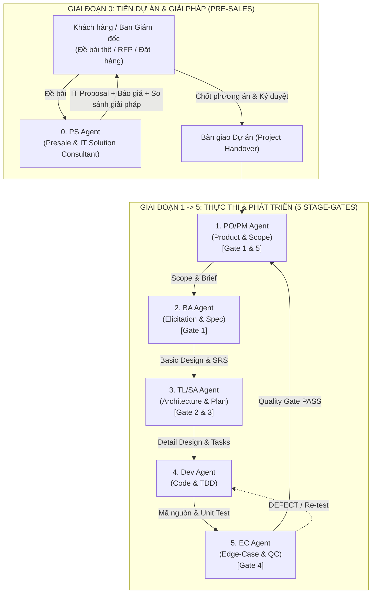

# TC IT Agent Framework — Khung Vận Hành Đa Tác Tử Doanh Nghiệp (Multi-Agent Enterprise v2.1)

> **TC IT Agent** là bộ khung điều phối AI Agent toàn diện dành cho phát triển phần mềm doanh nghiệp, được đúc kết từ tinh hoa của hai phương pháp luận hàng đầu: **GitHub Spec Kit** (Đặc tả chính xác) và **BMad Method** (Tranh biện đối kháng đa tác tử & kiểm thử đa tầng).  
> **Phiên bản 2.2 Enterprise**: Bổ sung **Tiêu Chuẩn Kiểm Soát Bề Mặt Toàn Diện & Kiểm Thử 4 Tầng (`TC-IT-STANDARD-04`)**, cơ chế Grep-first Surface Discovery, User Scope Gate, Kỷ luật Zero-Mock trên Client, và nâng cấp `ec-test` sang chuẩn kiểm định 4 tầng khép kín kèm Screen Coverage Guard.

---

## 1. Cấu Trúc Toàn Diện Gói TC IT Agent Framework

```text
TC IT Agent/
├── .agents/                      # 6 Persona tác tử chuyên trách toàn vòng đời dự án
│   ├── ps.md                     # Presale & IT Solution Consultant (Proposal, WBS, TCO, RFP)
│   ├── po-pm.md                  # Product Owner & Project Manager (Scope, Roadmap, Gate 1 & 5)
│   ├── ba.md                     # Senior Business Analyst (Khơi gợi 9D, Basic Design, SRS 7 mục)
│   ├── techlead-sa.md            # Software Architect & Tech Lead (Detail Design, Gate 2 & 3 Review)
│   ├── dev.md                    # Senior Full-Stack Developer (Thực thi 1:1, 5 UX States, TDD)
│   └── ec.md                     # Edge-Case Hunter & QC Specialist (Gate 4, Fuzzing, Playwright E2E)
│
├── docs/                         # Tài liệu tiêu chuẩn và hướng dẫn kiến trúc
│   └── CROSS_SURFACE_AND_4TIER_TESTING_STANDARD.md # [MỚI] Tiêu chuẩn kiểm soát bề mặt & test 4 tầng
│
├── skills/                       # Thư viện kỹ năng chuẩn hóa 100% theo tiền tố Role & Workflows
│   ├── ps-proposal/              # [PS] Soạn thảo IT Technical Proposal chuyên nghiệp
│   ├── ps-estimate/              # [PS] Bóc tách Man-Month & dự toán TCO hạ tầng Cloud
│   ├── ps-solution/              # [PS] So sánh Trade-off các phương án kiến trúc
│   ├── ps-rfp/                   # [PS] Thẩm định hồ sơ thầu & báo cáo tính khả thi
│   ├── po-scope/                 # [PO] Sàng lọc yêu cầu & Ma trận tác động lan truyền
│   ├── po-roadmap/               # [PO] Quản trị Master Roadmap, Milestones & Epics
│   ├── po-gate/                  # [PO] Biên bản nghiệm thu DoD & Phê duyệt xuất xưởng (Gate 5)
│   ├── po-party/                 # [PO] Triệu tập hội nghị bàn tròn đa tác tử (Party Mode)
│   ├── po-course/                # [PO] Nắn dòng dự án & phát hiện trôi dạt yêu cầu (Anti-Drift)
│   ├── po-issues/                # [PO] Đồng bộ danh sách tasks thành GitHub Issues
│   ├── xong/                     # [PO] Nghiệm thu toàn diện DoD, cập nhật Living Docs & đóng spec xuất xưởng
│   ├── ba-elicit/                # [BA] 9 kỹ thuật khơi gợi nghiệp vụ chuyên sâu (5 Whys...)
│   ├── ba-design/                # [BA] Soạn thảo Thiết kế Cơ sở (Kihon Sekkei) & Living Docs
│   ├── ba-srs/                   # [BA] Soạn thảo đặc tả SRS 7 mục khép kín (REQ-, BR-)
│   ├── ba-trace/                 # [BA] Kiểm toán ma trận truy vết khép kín REQ ↔ BR ↔ DB ↔ Test
│   ├── ba-clarify/               # [BA] Đặt tối đa 5 câu hỏi trọng tâm làm rõ điểm nghẽn (Cấm đoán mò)
│   ├── ba-docx/                  # [BA] Xuất bản tài liệu sang định dạng Word DOCX trình ký
│   ├── sa-design/                # [SA] Thiết kế kỹ thuật chi tiết (ERD, OpenAPI, Sequences)
│   ├── sa-plan/                  # [SA] Lập kế hoạch kiến trúc kỹ thuật theo Epic (plan.md)
│   ├── sa-guard/                 # [SA] Vệ binh ranh giới Clean Architecture & dọn rác thư mục
│   ├── sa-review/                # [SA] Rà soát mã nguồn đối kháng khắt khe (Gate 3)
│   ├── sa-analyze/               # [SA] Phân tích tính nhất quán chéo 3 chiều (Gate 2)
│   ├── sa-refactor/              # [SA] Quét dự án cũ (Chỉ đọc) & Đề xuất giải pháp Refactor
│   ├── chot/                     # [SA] Chốt quyết định kiến trúc thành ADR & cập nhật open-questions.md
│   ├── dev-tasks/                # [Dev] Phân rã checklist công việc kỹ thuật [BE]/[FE]
│   ├── dev-code/                 # [Dev] Lập trình thực thi bám sát task có kiểm chứng [x]
│   ├── dev-uiux/                 # [Dev] Chuẩn hóa giao diện 5 trạng thái UX qua <Async>
│   ├── dev-unit/                 # [Dev] Viết Unit Test TDD cho toàn bộ Business Rules
│   ├── dev-converge/             # [Dev] Quét hội tụ mã nguồn và sinh bổ sung tasks còn thiếu
│   ├── ec-hunt/                  # [EC] Săn tìm lỗi biên, kịch bản ngoại lệ & dữ liệu cực hạn
│   ├── ec-e2e/                   # [EC] Tự động sinh kịch bản Playwright E2E từ AC
│   ├── ec-fuzz/                  # [EC] Fuzzing bảo mật & kiểm tra phân quyền RBAC/IDOR
│   ├── ec-contract/              # [EC] Kiểm định hợp đồng API Consumer-Provider, chống Breaking Changes
│   ├── ec-load/                  # [EC] Kiểm thử tải và stress testing (k6/autocannon), tìm điểm sập
│   ├── ec-chaos/                 # [EC] Kiểm thử hỗn loạn (Chaos Engineering), bơm lỗi DB/Queue/Timeout
│   ├── ec-mutation/              # [EC] Kiểm thử đột biến (Mutation Testing), thử lửa chất lượng test
│   ├── pr-review-guard/          # [SA/Dev] Gác cổng thẩm định Task DoD và Pull Request theo 6 trục kiểm soát (Gate 3)
│   ├── ec-test/                  # [EC] Điều phối bộ kiểm thử 4 tầng khép kín (Gate 4) & Screen Coverage Guard
│   └── wf-*/                     # [Workflows] Các quy trình thực thi chuẩn (autopilot, delta, pr-review, audit...)
│
├── scripts/                      # Kịch bản tự động hóa & chốt chặn chất lượng
│   ├── guard-rails.sh            # Chốt chặn toán học tự động chống ảo giác & vi phạm kiến trúc
│   └── render_srs_html.py        # Kịch bản render tài liệu SRS sang HTML báo cáo trực quan
│
├── workflows/                    # Bộ quy trình vận hành liên Agent
│   ├── wf-presale.md             # Đề bài thô -> Thẩm định khả thi -> Proposal & Báo giá
│   ├── wf-kickoff.md             # Hợp đồng duyệt -> Basic Design (Walking Skeleton) & Roadmap
│   ├── wf-autopilot.md           # Toàn trình tự động 1 Epic: Spec -> Plan -> Code -> Test -> Ship
│   ├── wf-pr-review.md           # Kỷ luật gác cổng Task DoD, Pull Request & Stage-Gate 3 & 4
│   ├── wf-delta.md               # Tiếp nhận Change Request: Tài liệu đi trước, Code theo sau
│   ├── wf-uiux.md                # Chuẩn hóa 5 trạng thái UX & Chụp ảnh Visual QA Playwright
│   └── wf-audit.md               # Kiểm toán hệ thống toàn diện trước ngày phát hành
│
├── templates/                    # Bộ biểu mẫu nghiệp vụ & kỹ thuật chuẩn hóa
│   ├── TEMPLATE-it-proposal.md   # Mẫu IT Technical Proposal chuẩn trình C-Level / Khách hàng
│   ├── TEMPLATE-cost-estimation.md # Mẫu bảng tính Man-Month, chi phí Cloud & TCO
│   ├── TEMPLATE-basic-design.md  # Mẫu Thiết kế Cơ sở (Kihon Sekkei)
│   ├── TEMPLATE-task-review-checklist.md # Mẫu checklist tự rà soát cho từng Task
│   ├── TEMPLATE-pull-request.md  # Mẫu Pull Request theo 6 trục kiểm soát & 2 cổng duyệt
│   ├── pull_request_template.md  # Template Pull Request dùng sẵn cho GitHub
│   ├── TEMPLATE-detail-design-erd.md # Mẫu Thiết kế CSDL, Data Dictionary & ERD
│   ├── TEMPLATE-detail-design-api.md # Mẫu Hợp đồng API RESTful chuẩn
│   ├── TEMPLATE-SRS-7-muc.md     # Mẫu đặc tả phần mềm 7 mục khép kín
│   ├── TEMPLATE-yeu-cau-thay-doi.md # Mẫu phiếu yêu cầu thay đổi (CR)
│   ├── AGENTS.enterprise.template.md # Bộ luật điều hành AI Agent trong dự án
│   ├── constitution.template.md  # Mẫu Hiến pháp chất lượng kỹ thuật
│   └── adapters/                 # Bộ chuyển đổi đa nền tảng (.cursorrules, CLAUDE.md, etc.)
│
├── template-workspace/           # Cấu trúc thư mục mẫu chuẩn mực sẵn sàng nhân bản
├── docs/                         # Báo cáo và tài liệu hướng dẫn
│   ├── TC_IT_AGENT_MASTER_PRD.md # Tài liệu PRD & Kế hoạch tổng thể v2.0
│   ├── KE_HOACH_TAI_CAU_TRUC_TC_IT_AGENT.html # Báo cáo giao diện trực quan hiện đại
│   └── BAO_CAO_TEAM_AGENT_VA_WORKFLOW.html # Báo cáo phân tích chuyên sâu
│
├── install.sh                    # Trình cài đặt & Cập nhật Universal tự động
└── README.md                     # Cẩm nang tài liệu này
```

---

## 2. Hướng Dẫn Tích Hợp Vào Các Dự Án IT Khác

### Trường Hợp 1: Tích Hợp Vào Dự Án Mới Tinh (Greenfield Project)

Dành cho khi bạn bắt đầu một dự án mới hoàn toàn từ đầu (chưa có code):

1. **Chạy lệnh cài đặt**:
   ```bash
   # Di chuyển vào thư mục TC IT Agent và chạy:
   ./install.sh /duong-dan/toi/du-an-moi --name "TenDuAnMoi" --all
   ```
2. **Hệ thống sẽ tự động**:
   - Thiết lập cấu trúc cây thư mục sạch chống rác (`docs/`, `backlog/`, `specs/`, `src/`, `tests/`).
   - Cài đặt 6 Persona vào `.agents/` và toàn bộ kỹ năng `skills/`, `workflows/`.
   - Kích hoạt adapters cho mọi IDE: Cursor (`.cursorrules`), Windsurf (`.windsurfrules`), Claude Code (`CLAUDE.md`).
   - Tạo sẵn file script cập nhật 1 chạm `update-tc-agent.sh`.
3. **Quy trình bắt đầu làm việc**:
   - **Nếu đang đấu thầu/làm giải pháp**: Mở chat gõ `/wf-presale de-bai.txt` để **PS Agent** làm Proposal & Báo giá.
   - **Nếu đã chốt dự án**: Gõ `/wf-kickoff` để **PO/PM** và **BA** dựng Basic Design (Kihon Sekkei) và Master Roadmap.
   - **Khi bắt đầu làm tính năng**: Gõ `/wf-autopilot specs/EPIC-01` để chạy tự động toàn trình.

---

### Trường Hợp 2: Tích Hợp Vào Dự Án Đang Chạy Dở (Brownfield / Legacy Project)

Dành cho dự án đã có sẵn mã nguồn, đang chạy thực tế mà bạn muốn đưa đội Agent vào vận hành:

1. **Chạy lệnh cài đặt**:
   ```bash
   ./install.sh /duong-dan/toi/du-an-dang-chay --name "TenDuAnHienTai" --all
   ```
   *Lưu ý an toàn*: Script sẽ **tạo thêm** các thư mục tài liệu quản lý còn thiếu (`docs/`, `specs/`, `backlog/`, `.agents/`) và **KHÔNG BAO GIỜ** ghi đè hay làm mất bất kỳ file code hiện có nào của bạn trong `src/`!

2. **Quy trình Quét & Đề Xuất Giải Pháp Refactor An Toàn (Zero Risk)**:
   - **Bước A (Quét Hiện Trạng & Đề Xuất Refactor)**:
     Chạy lệnh:
     ```text
     /wf-refactor
     ```
     ➔ **TL/SA Agent** kích hoạt kỹ năng `sa-refactor` chạy ở **chế độ chỉ đọc (Strictly Read-Only)**:
     - Quét toàn bộ mã nguồn cũ, dependencies, ORM CSDL và điểm nghẽn hiệu năng.
     - **TUYỆT ĐỐI KHÔNG** tự ý sửa, xóa, di chuyển bất kỳ dòng code cũ nào.
     - Tự động sinh bộ tài liệu hoàn chỉnh tại thư mục quản trị:
       + `docs/02-detail-design/AS_IS_SYSTEM_ANALYSIS.md` (Phân tích nợ kỹ thuật hệ thống cũ)
       + `docs/02-detail-design/TO_BE_ARCHITECTURE.md` (Bản vẽ Clean Architecture mục tiêu)
       + `docs/00-presale-proposal/REFACTORING_PROPOSAL.md` (Hồ sơ giải pháp & Báo giá Man-Month cho Giám đốc)
       + `backlog/REFACTORING_ROADMAP.md` (Lộ trình tái cấu trúc từng bước an toàn theo Strangler Fig Pattern)

   - **Bước B (Đảo ngược tài liệu - Reverse Engineering)**:
     Yêu cầu **BA Agent** và **SA Agent**:
     > *"Dựa trên mã nguồn hiện tại trong src/ và database schema, hãy tái tạo lại tài liệu Thiết kế Cơ sở tại docs/01-basic-design/ và Master Roadmap tại backlog/ROADMAP.md."*
     ➔ Giúp hệ thống AI "học" toàn bộ tri thức của dự án cũ mà không cần bạn phải viết lại tài liệu từ đầu bằng tay!

   - **Bước C (Phát triển tiếp các tính năng mới hoặc xử lý yêu cầu thay đổi)**:
     - Khi có tính năng mới: Dùng `/wf-autopilot specs/EPIC-XX`.
     - Khi có yêu cầu sửa đổi logic cũ: Dùng `/wf-delta CR-XX` (bảo đảm cập nhật tài liệu trước khi sửa code, không làm gãy tính năng cũ).


---

## 3. Cơ Chế Nâng Cấp & Đồng Bộ Khi Team Agent Được Cập Nhật

### Câu hỏi: *"Khi nâng cấp agent thì tôi nâng cấp ở folder dự án này và đẩy lên git, các dự án tích hợp lấy code mới nhất về là update được đúng không?"*

👉 **ĐÚNG HOÀN TOÀN!** Bạn nâng cấp Agent, bổ sung Skill hoặc cải tiến Prompt tại kho nguồn **`TC IT Agent`** này, sau đó đẩy lên Git. Các dự án con lấy bản cập nhật mới nhất cực kỳ dễ dàng và **an toàn tuyệt đối cho mã nguồn dự án**.

Hệ thống hỗ trợ 2 cơ chế cập nhật:

---

### Cơ Chế 1: Cập Nhật 1 Chạm Qua Script `update-tc-agent.sh` (Khuyên Dùng)

Khi cài đặt vào bất kỳ dự án nào, `install.sh` đã tự động sinh một script tiện ích mang tên **`update-tc-agent.sh`** ngay tại thư mục dự án đó.

**Quy trình cập nhật cực kỳ đơn giản:**
1. Tại thư mục **TC IT Agent** (kho nguồn):
   ```bash
   # Kéo bản mới nhất từ Git về:
   git pull origin main
   ```
2. Tại **dự án con** của bạn (ví dụ `MyProject/`):
   ```bash
   # Chỉ cần chạy duy nhất 1 lệnh:
   ./update-tc-agent.sh
   ```
   *Lệnh này tương đương với: `path/to/TC IT Agent/install.sh . --update`*

#### Điều gì diễn ra khi chạy Update?
- ✅ **Cập nhật mới nhất**: Toàn bộ 6 Personas trong `.agents/`, toàn bộ Kỹ năng trong `skills/`, toàn bộ Quy trình trong `workflows/` và các rules IDE (`.cursorrules`, `CLAUDE.md`, `.windsurfrules`).
- 🛡️ **BẢO VỆ TUYỆT ĐỐI**: Script **KHÔNG BAO GIỜ** chạm vào mã nguồn (`src/`), dữ liệu tài liệu (`docs/`), kế hoạch (`backlog/`) hay đặc tả (`specs/`) của dự án con. Mã nguồn và tiến độ dự án của bạn được giữ an toàn 100%.

---

### Cơ Chế 2: Cài Đặt Toàn Cục (Global Mode Cho Antigravity)

Nếu bạn sử dụng Google Antigravity IDE và muốn **mọi dự án trên máy tính đều dùng chung một bộ Kỹ năng mới nhất**:
1. Tại thư mục **TC IT Agent**, sau khi `git pull`:
   ```bash
   ./install.sh --global
   ```
2. Lệnh này sẽ cập nhật trực tiếp toàn bộ 30+ kỹ năng vào thư viện toàn cục `~/.gemini/config/skills/`.
3. Mọi dự án đang mở trên máy tính của bạn sẽ **ngay lập tức nhận được các kỹ năng mới nhất** mà không cần phải chạy lại lệnh cài đặt ở từng dự án con!

---

## 4. Chu Trình 6 Tác Tử Toàn Vòng Đời Phần Mềm



---

## 5. Bảng Tra Cứu Nhanh Lệnh & Quy Trình

| Lệnh Gõ Tắt / Chat | Role Chủ Trì | Tác Vụ Cụ Thể |
| :--- | :--- | :--- |
| **`/wf-presale`** | **`ps`** (Presale) | Lập IT Technical Proposal, tính toán Man-Month và dự toán chi phí TCO Cloud. |
| **`/wf-kickoff`** | **`po-pm`** (PO/PM) | Khởi tạo Basic Design (Walking Skeleton) và Master Roadmap ban đầu. |
| **`/wf-refactor`** | **`sa`** (TL/SA) | Quét toàn diện dự án cũ (Chỉ đọc) & Đề xuất giải pháp Refactor an toàn 100%. |
| **`/wf-autopilot [epic-id]`** | **`po-pm`** (PO/PM) | Tự động hóa toàn trình phát triển 1 Epic: Spec ➔ Plan ➔ Code ➔ Test ➔ Xuất xưởng. |
| **`/wf-hotfix [bug-id]`** | **`ec` + `dev`** | Vá lỗi khẩn cấp Production/UAT: Viết Red Test tái hiện ➔ Sửa mã tối thiểu ➔ Zero Regression. |
| **`/wf-delta [cr-id]`** | **`sa` + `ba`** | Xử lý yêu cầu thay đổi (CR) chuẩn: Sửa tài liệu kiến trúc trước, sửa code sau. |
| **`/wf-uiux [epic-id]`** | **`dev`** (Dev) | Chuẩn hóa 5 trạng thái UX qua `<Async>` và tự động chụp ảnh Playwright Visual QA. |
| **`/wf-audit`** | **`sa`** (TL/SA) | Kiểm toán toàn diện: Clean Architecture, Traceability khép kín và dọn sạch rác thư mục. |
| **`po-party`** | **`po-pm`** (PO/PM) | Triệu tập Hội nghị Bàn tròn 6 Agent cùng tranh luận giải quyết bài toán khó. |

---

## 6. Tài Liệu Báo Cáo Trực Quan
Để xem phân tích kiến trúc trực quan, sơ đồ tuần tự và so sánh phương pháp luận:
- [docs/KE_HOACH_TAI_CAU_TRUC_TC_IT_AGENT.html](docs/KE_HOACH_TAI_CAU_TRUC_TC_IT_AGENT.html) — Báo cáo giao diện trực quan v2.0 hiện đại (Theme tối, biểu đồ Mermaid).
- [docs/TC_IT_AGENT_MASTER_PRD.md](docs/TC_IT_AGENT_MASTER_PRD.md) — Đặc tả sản phẩm và tài liệu PRD chi tiết.
