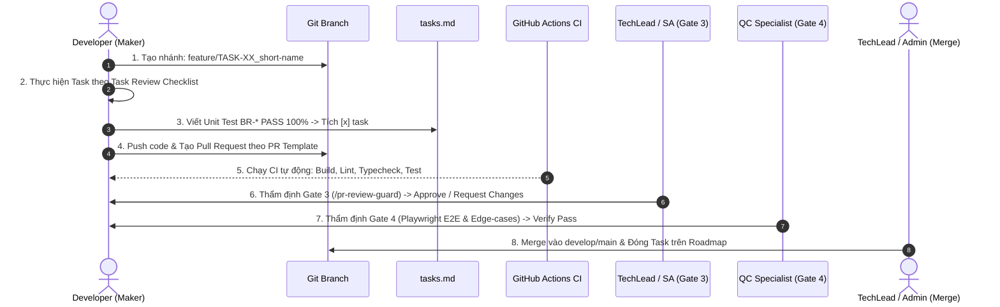
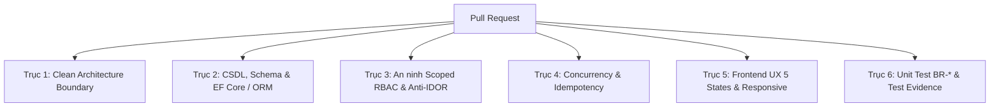

# QUY TRÌNH & CHECKLIST KIỂM SOÁT CHẤT LƯỢNG TASK VÀ PULL REQUEST (STAGE-GATE 3 & 4)
*TC IT Agent Framework | Phiên bản: 2.0.0-Enterprise*  
*Đối tượng áp dụng: TechLead, Software Architect, Developers, QC Specialists và AI Agents*

---

## 1. MỤC TIÊU & NGUYÊN TẮC CỐT LÕI

Tài liệu này chuẩn hóa quy trình **Kiểm soát chất lượng mã nguồn từ mức Task đến Pull Request (PR)**:
1. **Tránh làm tắt / Hình thức**: Không có chuyện tự động tick `[x]` vào task khi chưa có test chạy thực tế.
2. **Bảo vệ Ranh giới Kiến trúc**: Tuyệt đối không để rò rỉ ORM Context/DbContext lên API, cấm phụ thuộc ngược từ Domain sang hạ tầng, bảo vệ mô hình Clean Architecture & Modular Monolith.
3. **An ninh & Toàn vẹn Dữ liệu**: Chặn đứng rò rỉ dữ liệu chéo tổ chức (Cross-Tenant/IDOR), migration CSDL phi phá hủy, ngăn ngừa lỗi N+1 query và race condition.
4. **Trách nhiệm Maker - Checker (Phân công SoD)**: Không ai được tự merge code của chính mình. Mỗi PR phải qua 2 cổng độc lập: **Gate 3 (TechLead/SA)** và **Gate 4 (QC Verification)**.

---

## 2. CHU TRÌNH VẬN HÀNH TỔNG THỂ (LIFECYCLE FLOW)

---

## 3. CHECKLIST KIỂM SOÁT DÀNH CHO TỪNG TASK (TASK-LEVEL REVIEW)

Mỗi task trong file `specs/TASK-XX/tasks.md` phải tuân thủ 3 giai đoạn:

### Giai đoạn 1: Trước khi gõ code (Pre-Task Grooming)
- [ ] **Khớp nối mã định danh**: Đã xác định rõ các mã `REQ-`, `BR-`, `DB-`, `UI-`, `API-` tương ứng từ `spec.md`.
- [ ] **Xác định ranh giới (Boundary)**: Task này thuộc phân hệ nào? Có sửa đổi bảng dùng chung không? Có ảnh hưởng API của phân hệ khác không?
- [ ] **Cross-Surface Impact**: Nếu thêm hoặc đổi trường dữ liệu, đã rà soát đồng bộ: Entity $\rightarrow$ DTO $\rightarrow$ API $\rightarrow$ Database Migration $\rightarrow$ Web UI $\rightarrow$ Mobile App.

### Giai đoạn 2: Trong khi lập trình (Implementation Integrity)
- [ ] **Backend Clean Architecture**:
  - Không viết business logic trong Controller hoặc Minimal API.
  - Mọi thao tác ghi dùng `Command`, thao tác đọc dùng `Query`.
  - **CẤM** tiêm trực tiếp `DbContext` hay ORM context vào Controller / Endpoints.
  - 100% I/O và truy vấn database sử dụng `async/await`.
- [ ] **Frontend (React / Vue / Mobile)**:
  - Bao phủ đủ **5 trạng thái UX** qua component `<Async>`: `Loading` (Skeleton), `Empty`, `Error` (kèm nút Thử lại), `Success`, `Partial` (phân trang).
  - Nút bấm Submit form có hiệu ứng loading và tự động `disabled` ngay khi click để chống double-click.
  - Dữ liệu danh mục/chung lấy qua hook/SDK tập trung, **CẤM hardcode** mảng tĩnh tại từng trang.

### Giai đoạn 3: Định nghĩa hoàn thành Task (Task DoD)
- [ ] **Unit Test nghiệp vụ**: Đã viết Unit Test bao phủ 100% các điều kiện trong `BR-*` liên quan và chạy PASS.
- [ ] **Build Local không lỗi**:
  - Backend: Build Release (0 Error, 0 Warning).
  - Frontend: Lint && Typecheck pass 100%.
- [ ] **Đánh dấu hoàn thành**: Chỉ khi thỏa mãn 2 điều kiện trên mới được tick `[x]` vào `tasks.md`.

---

## 4. CHECKLIST 6 TRỤC KIỂM SOÁT PULL REQUEST (PR-LEVEL REVIEW)

Tất cả Pull Request phải tuân thủ file template `templates/pull_request_template.md`:

### Trục 1: Kiến trúc & Ranh giới Tầng (Clean Architecture)
1. **Kiểm tra Controller**: Tuyệt đối không có ORM Context / DbContext được inject trực tiếp vào Controller. Chỉ chấp nhận qua Service/Mediator/UseCases.
2. **Kiểm tra Domain**: Thư mục `Domain/` không được tham chiếu bất kỳ package hạ tầng bên ngoài nào.
3. **CQRS Response**: Queries sử dụng NoTracking, trả về DTO gọn nhẹ; không để rò rỉ Domain Entity ra ngoài response.

### Trục 2: CSDL, Schema & Migration
1. **Migration phi phá hủy (Non-destructive)**:
   - CẤM xóa cột (`DropColumn`) hoặc đổi kiểu dữ liệu trực tiếp khi chưa có migration chuyển tiếp.
   - Cột mới thêm bắt buộc phải có `defaultValue` hoặc chấp nhận `nullable`.
2. **Chặn lỗi N+1 Query**:
   - Không thực thi câu query DB trong vòng lặp `foreach`.
   - Sử dụng Eager loading hoặc Select projection hợp lý.
3. **Chỉ mục (Indexing)**:
   - Các cột lọc/tìm kiếm thường xuyên (`OrgId`, `TenantId`, `Status`, `CreatedAt`) bắt buộc có Index.
4. **Khóa lạc quan (Optimistic Locking)**:
   - Các bảng giao dịch tài chính, phê duyệt hồ sơ bắt buộc có Concurrency Token (`RowVersion` hoặc `xmin`).

### Trục 3: An ninh & Scoped RBAC
1. **Ma trận phân quyền Scoped**:
   - Mọi endpoint API (trừ public) bắt buộc gắn Policy theo: `Role` (Ai), `Scope` (Phạm vi đơn vị/tổ chức), `Action` (Quyền thao tác C/R/U/D).
2. **Chống IDOR / Rò rỉ dữ liệu chéo**:
   - Khi truy vấn tài nguyên theo ID, bắt buộc filter kèm quyền sở hữu: `Where(x => x.Id == id && x.OrgId == currentOrgId)`.
3. **Upload File an toàn**:
   - Kiểm tra **Magic Bytes** thực tế (header file nhị phân), không chỉ tin cậy MIME-type do client gửi lên.

### Trục 4: Concurrency, Idempotency & Tự phục hồi
1. **Idempotency Key**:
   - Các API tạo đơn, chuyển tiền, thanh toán phải hỗ trợ header `Idempotency-Key` để chặn duplicate request khi người dùng submit nhiều lần hoặc mạng chập chờn.
2. **Database Transaction**:
   - Các chuỗi thao tác ghi trên nhiều bảng phải được bọc trong Transaction hoặc Transactional Outbox.

### Trục 5: Frontend & Trải nghiệm Người dùng
1. **Bao phủ 5 trạng thái UX**:
   - Đầy đủ Skeleton Loading, Empty State có minh họa, Error State có nút "Thử lại", Success State và Pagination/Partial.
2. **Responsive & Chống tràn chữ**:
   - Giao diện chuẩn trên cả Desktop, Tablet và Mobile; xử lý `text-overflow: ellipsis`, không bị vỡ layout khi nội dung quá dài.
3. **Chống Double Submit**:
   - Nút Submit form tự động disabled ngay sau khi click.

### Trục 6: Kiểm thử & Bằng chứng nghiệm thu
1. **Độ phủ Unit Test**: 100% quy tắc nghiệp vụ `BR-*` đều có Unit Test độc lập chạy PASS.
2. **Test Evidence bắt buộc**: PR phải đính kèm:
   - Log terminal chạy test pass 100%.
   - Ảnh chụp giao diện thực tế (hoặc response API Postman/Swagger).

---

## 5. HAI CỔNG KIỂM SOÁT ĐỘC LẬP (GATE 3 & GATE 4 APPROVAL)

Một PR **chỉ đủ điều kiện merge** khi cả 2 cổng sau đây được duyệt:

| Cổng Duyệt | Người Phụ Trách | Công Cụ Sử Dụng | Tiêu Chuẩn Phê Duyệt |
| :--- | :--- | :--- | :--- |
| **Gate 3: Kiến Trúc & Code Review** | TechLead / Software Architect | Skill `/pr-review-guard` | Đạt 100% 6 trục kiểm soát; 0 vi phạm Clean Architecture; Migration phi phá hủy; An ninh Scoped RBAC chuẩn. |
| **Gate 4: Kiểm Thử Đa Tầng** | QC Specialist | Skill `ec-test` / `ec-e2e` | Chạy pass toàn bộ Unit, Integration và E2E tests; xác nhận hành trình người dùng và 5 trạng thái UX. |

---

## 6. QUY TẮC CƯỠNG CHẾ & XỬ PHẠT VI PHẠM (ENFORCEMENT RULES)

1. **Quy tắc Cấm Vượt Rào (Zero-Bypass Rule)**:
   - Tuyệt đối không ai (kể cả TechLead hay Admin) được merge PR khi thiếu 1 trong 2 chữ ký Gate 3 hoặc Gate 4.
2. **Quy tắc Chống Check Hình Thức (Zero-Fake-Check Rule)**:
   - Nếu PR tích `[x]` nhưng không có ảnh chụp hoặc log bằng chứng kiểm thử tương ứng $\rightarrow$ **Tự động đóng PR và yêu cầu bổ sung bằng chứng**.
3. **Cơ chế Tự Động Hóa Gác Cổng (Guardrails)**:
   - GitHub Actions CI tự động build và chạy test trên mỗi PR.
   - Skill `pr-review-guard` tự động cảnh báo và từ chối hỗ trợ nếu phát hiện vi phạm quy trình.
