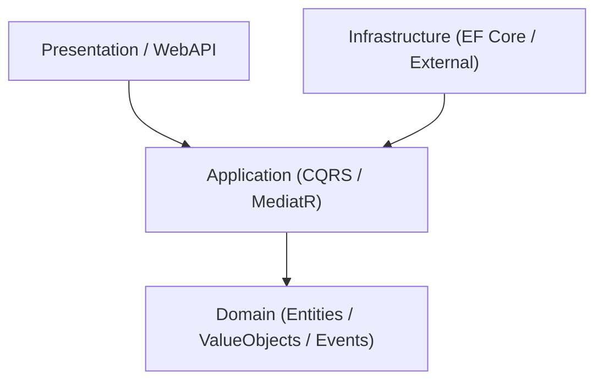

# Clean Architecture & Modular Monolith Sentinel (`clean-arch-guard`)

Skill chuyên trách dành cho **Agent TechLead / SA** và **Agent Dev Senior** để bảo vệ tính toàn vẹn của mã nguồn.

## 1. CÁC QUY TẮC RANH GIỚI BẤT BIẾN (ARCHITECTURAL INVARIANTS)

### Backend .NET Core Clean Architecture

1. **Quy tắc Vàng về Chiều Phụ Thuộc**:
   - `Domain`: Hoàn toàn độc lập. CẤM `using Microsoft.EntityFrameworkCore;` hoặc bất kỳ package ngoài nào.
   - `Application`: Chỉ phụ thuộc vào `Domain`. Giao tiếp với hạ tầng qua Interfaces/Abstractions.
   - `Infrastructure`: Triển khai các Interfaces của `Application` (DbContext, Mail, S3...).
   - `WebAPI`: Chỉ đóng vai trò cấu hình DI, middleware và nhận request. **TUYỆT ĐỐI CẤM tiêm trực tiếp `AppDbContext` vào Controller / Minimal API endpoints**.
2. **Quy tắc CQRS & Result Pattern**:
   - Mọi luồng xử lý ghi (Commands) và đọc (Queries) bắt buộc đi qua MediatR Handlers.
   - Trả về kết quả thông qua `Result<T>` hoặc `Result`, không ném Exception cho các lỗi nghiệp vụ dự đoán được.

### Frontend React / TypeScript
1. **Component Phân Tách Trách Nhiệm**:
   - UI Components (Dumb components): Chỉ nhận props và render.
   - Container / Hooks (Smart components): Quản lý state và gọi API.
2. **Chuẩn Hóa 5 Trạng Thái UX**:
   - Mọi trang tải dữ liệu từ API bắt buộc bọc qua component `<Async>` hiển thị đủ 5 trạng thái: `Empty`, `Loading`, `Error`, `Success`, `Partial`.

## 2. QUY TRÌNH KIỂM TRA MÃ NGUỒN
Khi được kích hoạt trên Pull Request hoặc thư mục `SourceCode/backend/` hoặc `SourceCode/frontend/`:

1. **Quét Static References (`grep / AST`)**:
   - Kiểm tra xem có file nào trong thư mục `Domain/` sử dụng namespace của `Infrastructure` hoặc `Microsoft.EntityFrameworkCore` không.
   - Kiểm tra xem trong các Controllers / Endpoints có inject `DbContext` trực tiếp hay không.
2. **Kiểm tra Async / Await**:
   - Đảm bảo 100% các cuộc gọi I/O, Database, Http Client đều sử dụng `async/await` kèm `CancellationToken`.
3. **Xuất Báo Cáo Vi Phạm**:
   - Liệt kê file vi phạm, dòng cụ thể và hướng dẫn sửa chữa theo chuẩn Clean Architecture.
