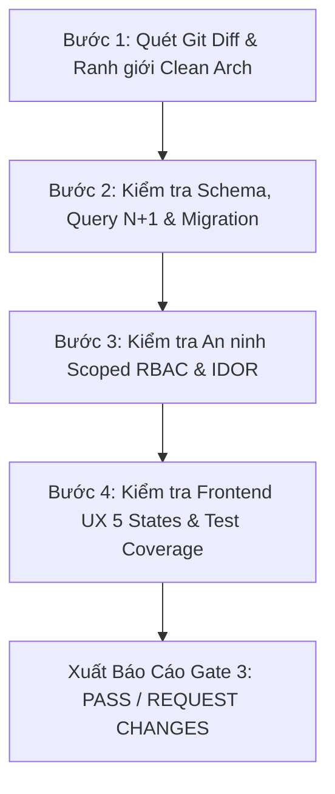

# Task & Pull Request Review Guardian (`pr-review-guard`)

Skill chuyên trách dành cho **Agent TechLead / SA** và **Senior Developers** để bảo đảm chất lượng mã nguồn trước khi tích hợp vào nhánh chính (`main`/`develop`).

---

## 1. KHI NÀO SỬ DỤNG
1. **Developer trước khi tạo PR hoặc trước khi gạt `[x]` trong `tasks.md`**: Kích hoạt để tự kiểm tra (Self-Review) xem mã nguồn đã đạt Task Definition of Done (DoD) hay chưa.
2. **TechLead / SA khi review PR (Gate 3 Approval)**: Kích hoạt để rà soát đối kháng (Adversarial Review) trên Diff của Pull Request theo 6 trục kiểm soát.
3. **Trước khi bàn giao sang QC (Gate 4)**: Đảm bảo không có lỗi kiến trúc, lỗi N+1 hay lỗ hổng bảo mật sơ đẳng lọt sang đội kiểm thử.

---

## 2. QUY TRÌNH 4 BƯỚC RÀ SOÁT TỰ ĐỘNG



### Bước 1: Quét Ranh giới Kiến trúc (Clean Architecture Boundary)
- Quét các file thay đổi trong PR:
  - Nếu tầng Domain có tham chiếu đến hạ tầng ngoài (ORM, External SDK, HttpClient) $\rightarrow$ **FLAG VIOLATION**.
  - Nếu API Controllers / Endpoints inject trực tiếp CSDL / ORM Context thay vì qua Use Cases / CQRS MediatR / Service Interfaces $\rightarrow$ **FLAG VIOLATION**.
  - Kiểm tra xem Command/Query có trả về Domain Entity thô thay vì DTO không.

### Bước 2: Thẩm định CSDL, Schema & Migration
- Nếu PR có file Migration mới:
  - Kiểm tra xem có lệnh xóa cột (`DropColumn`), đổi tên cột trực tiếp làm mất dữ liệu không $\rightarrow$ Nếu có, cảnh báo vi phạm **Migration phi phá hủy (Non-destructive)**.
  - Cột mới thêm bắt buộc có `defaultValue` hoặc chấp nhận `NULL`.
- Quét các câu truy vấn:
  - Có gọi truy vấn CSDL trong vòng lặp `foreach` không (Lỗi N+1 query).
  - Queries có dùng read-only projection (NoTracking) không.
  - Các bảng trạng thái quan trọng có Concurrency Token (Optimistic Locking) chống Race Condition không.

### Bước 3: Thẩm định An ninh & Scoped RBAC
- Với mỗi endpoint mới:
  - Có gắn Policy phân quyền theo `Role` + `Scope` (Tenant/Org) + `Action` không?
  - Có lỗ hổng IDOR không? (Truy vấn theo Id bắt buộc kèm điều kiện sở hữu `TenantId` / `OrgId` / `UserId`).
  - Endpoint upload file: Đã có kiểm tra Magic Bytes thực tế chưa, hay chỉ tin client content-type?

### Bước 4: Thẩm định Frontend & Độ phủ Kiểm thử
- Với code Frontend (React / Vue / Angular / Mobile):
  - Component tải dữ liệu có bọc đủ 5 trạng thái UX không (`Loading`, `Empty`, `Error`, `Success`, `Partial`)?
  - Có nút bấm Submit nào bị thiếu xử lý disable chống Double-click không?
  - Có hardcode dữ liệu tĩnh trong file trang thay vì dùng hook/SDK tập trung không?
- Với Test Coverage:
  - Đã có Unit Test bao phủ 100% các quy tắc `BR-*` trong spec chưa?
  - Có test assertion hình thức (`assertNotNull`) mà không assert giá trị thật không?

---

## 3. ĐỊNH DẠNG BÁO CÁO KẾT QUẢ REVIEW (GATE 3 VERDICT)

Sau khi hoàn tất rà soát, Agent xuất báo cáo chuẩn:

```markdown
### 🛡️ KẾT QUẢ THẨM ĐỊNH PR & TASK (GATE 3 AUDIT REPORT)
- **PR / Task**: [Tên Task hoặc Branch]
- **Reviewer**: TechLead / SA (Adversarial Mode)
- **Kết luận**: [✅ APPROVED / ⚠️ REQUEST CHANGES / ❌ REJECTED]

#### 1. Đánh giá 6 Trục Kiểm Soát:
- [x] Trục 1: Clean Architecture Boundary: ĐẠT
- [x] Trục 2: CSDL & Migration Phi Phá Hủy: ĐẠT
- [x] Trục 3: An ninh Scoped RBAC & Anti-IDOR: ĐẠT
- [x] Trục 4: Concurrency & Idempotency: ĐẠT
- [x] Trục 5: Frontend 5 UX States & Responsive: ĐẠT
- [x] Trục 6: Unit Test BR-* & Test Evidence: ĐẠT

#### 2. Chi tiết vấn đề cần sửa (nếu Request Changes):
1. **[Lỗi / Cảnh báo]**: Tại file `...`, dòng `...`: [Mô tả chi tiết và hướng dẫn sửa].

#### 3. Điều kiện để Merge:
- [ ] Khắc phục toàn bộ các điểm trên.
- [ ] Chạy test cục bộ pass 100%.
- [ ] Chuyển tiếp sang QC Specialist chạy kiểm thử Gate 4.
```
