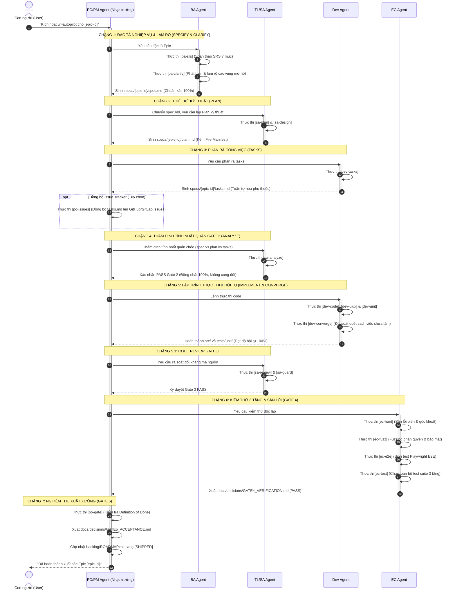

# QUY TRÌNH TOÀN TRÌNH TỰ ĐỘNG: wf-autopilot (TỪ ĐẶC TẢ ĐẾN MÃ NGUỒN HOÀN THIỆN)

> **Mã Quy Trình**: `wf-autopilot`  
> **Tác Tử Điều Phối**: **PO/PM Agent (`po-pm`)** — Product Owner & Project Manager  
> **Các Tác Tử Phối Hợp**: **BA (`ba`)**, **TL/SA (`techlead-sa`)**, **Dev (`dev`)**, **EC (`ec`)**  
> **Cổng Kết Thúc**: Quality Gate 5 Final Acceptance & Shipped Release

---

## 1. MỤC TIÊU CỐT LÕI
Phát triển khép kín tự động toàn diện một Epic/Tính năng qua 7 chặng Stage-Gate nghiêm ngặt:
- Đặc tả nghiệp vụ chuẩn xác 7 mục (REQ-, BR-).
- Thiết kế kiến trúc kỹ thuật chi tiết (C4, DB-, API-).
- Phân rã công việc tuần tự có kiểm chứng [x].
- Lập trình thực thi chuẩn Clean Architecture & 5 UX States.
- Kiểm thử 3 tầng khép kín (Unit, Integration, Playwright E2E Visual QA).
- Nghiệm thu Definition of Done (DoD) và cập nhật Roadmap.

---

## 2. BẢNG ĐIỀU HƯỚNG TỆP TIN ĐẦU RA (ENFORCED DIRECTORY CONTRACT)
Tất cả các tài liệu và mã nguồn BẮT BUỘC lưu tại:
- `specs/[epic-id]/spec.md` (Đặc tả SRS 7 mục)
- `specs/[epic-id]/plan.md` (Kế hoạch kỹ thuật & File Manifest)
- `specs/[epic-id]/tasks.md` (Checklist công việc thực thi [x])
- `src/` (Mã nguồn phân tầng: Domain, Application, Infrastructure, Presentation, WebApp)
- `tests/` (Kiểm thử: tests/unit/, tests/integration/, tests/e2e/)
- `docs/decisions/GATE4_VERIFICATION.md` (Biên bản kiểm định Gate 4)
- `docs/decisions/GATE5_ACCEPTANCE.md` (Biên bản nghiệm thu Gate 5)

---

## 3. CÁC CHẶNG THỰC THI TUẦN TỰ (7-STAGE CHOREOGRAPHY)

