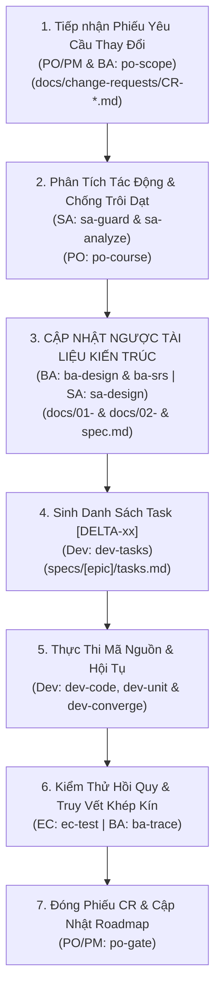

# QUY TRÌNH THAY ĐỔI YÊU CẦU: wf-delta (CHANGE REQUEST & CHỐNG TRÔI DẠT TRI THỨC)

> **Mã Quy Trình**: `wf-delta`  
> **Tác Tử Chủ Trì**: **TL/SA Agent (`techlead-sa`)** & **BA Agent (`ba`)**  
> **Tác Tử Phối Hợp**: **PO/PM Agent (`po-pm`)**, **Dev Agent (`dev`)**, **EC Agent (`ec`)**  
> **Cổng Kết Thúc**: Delta Acceptance & Regression Test Sign-off

---

## 1. NGUYÊN TẮC BẤT BIẾN: "TÀI LIỆU ĐI TRƯỚC, CODE THEO SAU" (SPEC-FIRST DELTA)

Trong phát triển phần mềm, thói quen nguy hiểm nhất là khi có yêu cầu sửa đổi, lập trình viên nhảy vào sửa code ngay mà quên cập nhật tài liệu kiến trúc. Điều này làm cho tài liệu bị lỗi thời (tri thức bị trôi dạt) và hệ thống dần trở thành đống rác khó bảo trì.

Quy trình `wf-delta` **nghiêm cấm tuyệt đối việc sửa code trước khi tài liệu thiết kế được cập nhật đồng bộ ngược**.

---

## 2. BẢNG ĐIỀU HƯỚNG TỆP TIN ĐẦU RA (ENFORCED DIRECTORY CONTRACT)
Tất cả các tài liệu thay đổi BẮT BUỘC lưu tại:
- `docs/change-requests/CR-[MÃ_CR]-[TÊN_RÚT_GỌN].md` (Phiếu yêu cầu thay đổi)
- Cập nhật ngược tài liệu Thiết kế Cơ sở: `docs/01-basic-design/`
- Cập nhật ngược tài liệu Thiết kế Chi tiết: `docs/02-detail-design/`
- Cập nhật tài liệu Đặc tả Epic: `specs/[epic-id]/spec.md`
- Bổ sung tasks Delta: `specs/[epic-id]/tasks.md` với tiền tố `[DELTA-xx]`

---

## 3. CÁC BƯỚC THỰC THI 5 GIAI ĐOẠN

### Bước 1: Tiếp Nhận & Khởi Tạo Phiếu CR [PO/PM + BA]
- **Kỹ năng sử dụng**: `po-scope`
- **Hành động**: Tiếp nhận yêu cầu mới, phân loại Scope Triage và điền đầy đủ thông tin vào mẫu `docs/change-requests/CR-[MÃ_CR].md`: Mô tả thay đổi, Lý do thay đổi, Người yêu cầu.

### Bước 2: Phân Tích Tác Động Chéo & Chống Trôi Dạt Nghiệp Vụ [TL/SA + PO/PM]
- **Kỹ năng sử dụng**: `sa-guard`, `sa-analyze` & `po-course`
- **Hành động**:
  - SA rà soát: Có đổi cấu trúc DB không? Có ảnh hưởng breaking changes lên API hiện hữu không? Module nào bị ảnh hưởng lan truyền?
  - PO chạy `po-course` để đối chiếu trạng thái thay đổi với PRD/Basic Design ban đầu, phát hiện độ lệch (Drift) và lập kế hoạch nắn dòng dự án về đúng quỹ đạo.

### Bước 3: Cập Nhật Ngược Tài Liệu (Upstream Documentation Update) [BA + SA]
- **Kỹ năng sử dụng**: `ba-design`, `ba-srs` & `sa-design`
- **Hành động**:
  - Cập nhật `docs/01-basic-design/` (nếu đổi luồng lớn).
  - Cập nhật `docs/02-detail-design/DD-*.md` (ERD, OpenAPI).
  - Cập nhật `specs/[epic-id]/spec.md` (Ghi rõ mục sửa đổi kèm phiên bản).

### Bước 4: Sinh Danh Sách Task Delta [Dev Agent]
- **Kỹ năng sử dụng**: `dev-tasks`
- **Hành động**: Thêm các task mới vào `specs/[epic-id]/tasks.md` mang ký hiệu `[DELTA-01]`, `[DELTA-02]` với đầy đủ thứ tự phụ thuộc.

### Bước 5: Thực Thi, Kiểm Thử Hồi Quy & Đóng CR [Dev + EC + BA + PO]
- **Kỹ năng sử dụng**: `dev-code`, `dev-unit`, `dev-converge`, `ec-test`, `ba-trace` & `po-gate`
- **Hành động**:
  - Dev sửa code theo đúng task `[DELTA-xx]`, chạy `dev-unit` và `dev-converge` để đảm bảo không bỏ sót bất kỳ điểm thay đổi nào.
  - EC Agent chạy toàn bộ test suite để đảm bảo không bị hỏng hóc tính năng cũ (Regression Test Pass 100%).
  - BA Agent quét lại ma trận truy vết (`ba-trace`).
  - PO/PM Agent nghiệm thu đóng phiếu CR và cập nhật `backlog/ROADMAP.md`.
