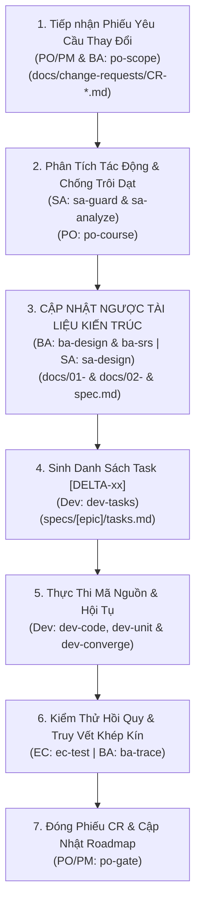

# QUY TRÌNH THAY ĐỔI YÊU CẦU: wf-delta (CHANGE REQUEST & CHỐNG TRÔI DẠT TRI THỨC)

> **Mã Quy Trình**: `wf-delta`  
> **Tác Tử Chủ Trì**: **TL/SA Agent (`techlead-sa`)** & **BA Agent (`ba`)**  
> **Tác Tử Phối Hợp**: **PO/PM Agent (`po-pm`)**, **Dev Agent (`dev`)**, **EC Agent (`ec`)**  
> **Cổng Kết Thúc**: Delta Acceptance & Regression Test Sign-off

---

## 1. NGUYÊN TẮC BẤT BIẾN: "TÀI LIỆU ĐI TRƯỚC, CODE THEO SAU" (SPEC-FIRST DELTA)

Trong phát triển phần mềm, thói quen nguy hiểm nhất là khi có yêu cầu sửa đổi, lập trình viên nhảy vào sửa code ngay mà quên cập nhật tài liệu kiến trúc. Điều này làm cho tài liệu bị lỗi thời (tri thức bị trôi dạt) và hệ thống dần trở thành đống rác khó bảo trì.

Quy trình `wf-delta` **nghiêm cấm tuyệt đối việc sửa code trước khi tài liệu thiết kế được cập nhật đồng bộ ngược**.

---

## 2. BẢNG ĐIỀU HƯỚNG TỆP TIN ĐẦU RA (ENFORCED DIRECTORY CONTRACT)
Tất cả các tài liệu thay đổi BẮT BUỘC lưu tại:
- `docs/change-requests/CR-[MÃ_CR]-[TÊN_RÚT_GỌN].md` (Phiếu yêu cầu thay đổi)
- Cập nhật ngược tài liệu Thiết kế Cơ sở: `docs/01-basic-design/`
- Cập nhật ngược tài liệu Thiết kế Chi tiết: `docs/02-detail-design/`
- Cập nhật tài liệu Đặc tả Epic: `specs/[epic-id]/spec.md`
- Bổ sung tasks Delta: `specs/[epic-id]/tasks.md` với tiền tố `[DELTA-xx]`

---

## 3. CÁC BƯỚC THỰC THI 5 GIAI ĐOẠN

### Bước 1: Tiếp Nhận, Khởi Tạo Phiếu CR & Quét Bề Mặt Toàn Cục [PO/PM + BA]
- **Kỹ năng sử dụng**: `po-scope` & `ba-clarify`
- **Hành động**:
  1. Tiếp nhận yêu cầu mới, điền vào mẫu `docs/change-requests/CR-[MÃ_CR].md`.
  2. **BƯỚC BẮT BUỘC (Grep-First Surface Discovery)**: Chạy lệnh grep toàn bộ codebase Frontend & Backend để tìm tất cả các vị trí tiêu thụ từ khóa/mã/enum bị thay đổi.
  3. Lập **Cross-Surface Impact Matrix**: Bảng 4 cột liệt kê tất cả các Bảng CSDL, API Endpoints và Màn hình UI bị tác động.
  4. **🛑 CỔNG DUYỆT PHẠM VI (USER SCOPE GATE)**: Trình Bảng Ma trận Bề mặt cho User/PO và đặt câu hỏi xác nhận phạm vi. **Chỉ chuyển sang Bước 2 khi nhận được xác nhận tường minh `XÁC NHẬN SCOPE`.**

### Bước 2: Phân Tích Tác Động Chéo & Chống Trôi Dạt Nghiệp Vụ [TL/SA + PO/PM]
- **Kỹ năng sử dụng**: `sa-guard`, `sa-analyze` & `po-course`
- **Hành động**:
  - SA rà soát: Có đổi cấu trúc DB không? Có ảnh hưởng breaking changes lên API hiện hữu không? Module nào bị ảnh hưởng lan truyền?
  - **Kiến trúc Dữ liệu Tập trung**: SA thiết kế Client Hook/SDK dùng chung (`useMasterData()`), cấm từng màn hình UI tự hardcode mảng danh mục tĩnh.
  - PO chạy `po-course` để đối chiếu trạng thái thay đổi với PRD/Basic Design ban đầu, phát hiện độ lệch (Drift) và lập kế hoạch nắn dòng dự án về đúng quỹ đạo.

### Bước 3: Cập Nhật Ngược Tài Liệu (Upstream Documentation Update) [BA + SA]
- **Kỹ năng sử dụng**: `ba-design`, `ba-srs` & `sa-design`
- **Hành động**:
  - Cập nhật `docs/01-basic-design/` (nếu đổi luồng lớn).
  - Cập nhật `docs/02-detail-design/DD-*.md` (ERD, OpenAPI).
  - Cập nhật `specs/[epic-id]/spec.md` (Ghi rõ mục sửa đổi kèm phiên bản).

### Bước 4: Sinh Danh Sách Task Delta [Dev Agent]
- **Kỹ năng sử dụng**: `dev-tasks`
- **Hành động**: Thêm các task mới vào `specs/[epic-id]/tasks.md` mang ký hiệu `[DELTA-01]`, `[DELTA-02]` với đầy đủ thứ tự phụ thuộc.

### Bước 5: Thực Thi Mã Nguồn — Kỷ Luật Zero-Mock & Global Sweep [Dev Agent]
- **Kỹ năng sử dụng**: `dev-code`, `dev-unit` & `dev-converge`
- **Kỷ luật bắt buộc**:
  - **Zero-Mock Rule**: Mọi màn hình CRUD/Quản trị phải có kết nối API thật, cấm dùng biến mock trong RAM.
  - **Global Sweep Rule**: Khi đổi mã/enum, Dev bắt buộc chạy lệnh `grep -rn "<MA_CU>" src/` kiểm tra toàn cục; **chỉ được tick `[x]` khi kết quả bằng 0**.

### Bước 6: Kiểm Thử 4 Tầng & Đối Soát Độ Phủ Màn Hình [EC Agent]
- **Kỹ năng sử dụng**: `ec-test` (Mô hình 4 Tầng: Unit $\rightarrow$ Contracts $\rightarrow$ DB Integration $\rightarrow$ E2E/RBAC Fuzzing).
- **Screen Coverage Guard**: QC bắt buộc đối soát Test Matrix bao phủ 100% các màn hình trong Cross-Surface Impact Matrix của Bước 1. Cấm ký Gate 4 nếu chỉ test Backend.

### Bước 7: Đóng Phiếu CR & Xuất Xưởng (Gate 5 Sign-off) [PO/PM]
- **Kỹ năng sử dụng**: `po-gate`
- **Hành động**: PO đối soát Definition of Done (DoD) và ký biên bản xuất xưởng khi đã có đầy đủ hồ sơ kiểm định Gate 4.
