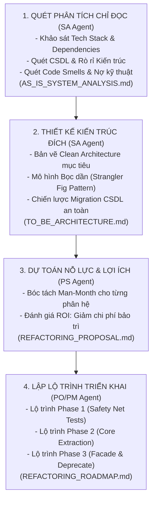

# QUY TRÌNH QUÉT & ĐỀ XUẤT REFACTOR DỰ ÁN CŨ: wf-refactor

> **Mã Quy Trình**: `wf-refactor`  
> **Tác Tử Chủ Trì**: **TL/SA Agent (`techlead-sa`)** — Software Architect & Tech Lead  
> **Tác Tử Phối Hợp**: **PS Agent (`ps`)**, **PO/PM Agent (`po-pm`)**, **EC Agent (`ec`)**  
> **Cổng Kết Thúc**: Refactoring Strategy & Modernization Roadmap Sign-off

---

## 1. MỤC TIÊU CỐT LÕI & NGUYÊN TẮC BẢO VỆ MÃ NGUỒN CŨ

Quy trình `wf-refactor` được thiết kế chuyên biệt cho các dự án đã tồn tại (Brownfield / Legacy):
1. **Quét toàn diện nhưng KHÔNG CAN THIỆP**: Chạy ở chế độ chỉ đọc (**Strictly Read-Only**). Không sửa đổi, không xóa, không di chuyển bất kỳ tệp tin mã nguồn hay dữ liệu CSDL nào của dự án cũ.
2. **Nhận diện đầy đủ nợ kỹ thuật (Technical Debt)**: Chỉ ra cụ thể các điểm nghẽn hiệu năng, rò rỉ bảo mật, spaghetti code, và vi phạm ranh giới kiến trúc.
3. **Đề xuất Kiến trúc Mục tiêu (To-Be Architecture)**: Thiết kế giải pháp Clean Architecture chuẩn mực nâng cấp hệ thống.
4. **Lộ trình từng bước (Strangler Fig Pattern)**: Tách nhỏ quá trình refactor thành các bước an toàn, cho phép hệ thống cũ vẫn vận hành 100% bình thường trong suốt quá trình nâng cấp.
5. **Dự toán nỗ lực & chi phí**: Tính toán Man-Month và bảng so sánh Lợi ích / Chi phí (Cost-Benefit Analysis) để trình Giám đốc hoặc Khách hàng.

---

## 2. BẢNG ĐIỀU HƯỚNG TỆP TIN ĐẦU RA (ENFORCED DIRECTORY CONTRACT)
Tất cả các báo cáo và đề xuất BẮT BUỘC lưu tại thư mục quản trị, **tuyệt đối không sinh file ở thư mục gốc**:
- `docs/02-detail-design/AS_IS_SYSTEM_ANALYSIS.md` (Báo cáo phân tích hiện trạng hệ thống cũ)
- `docs/02-detail-design/TO_BE_ARCHITECTURE.md` (Bản thiết kế kiến trúc đích chuẩn mực)
- `docs/00-presale-proposal/REFACTORING_PROPOSAL.md` (Hồ sơ đề xuất giải pháp & TCO trình Giám đốc/Khách hàng)
- `backlog/REFACTORING_ROADMAP.md` (Lộ trình tái cấu trúc chi tiết theo từng Milestone)

---

## 3. CÁC BƯỚC THỰC THI TUẦN TỰ (4-PHASE REFACTORING WORKFLOW)

### Chặng 1: Quét Phân Tích Chỉ Đọc [TL/SA Agent]
- **Kỹ năng sử dụng**: `sa-refactor`
- **Hành động**:
  - Quét cấu trúc cây thư mục, file cấu hình, dependencies, database models, controllers/routes.
  - Đo lường mức độ phụ thuộc (Coupling), điểm nghẽn hiệu năng, rủi ro bảo mật (Hardcoded secrets, thiếu validation).
- **Đầu ra**: `docs/02-detail-design/AS_IS_SYSTEM_ANALYSIS.md`.

### Chặng 2: Thiết Kế Kiến Trúc Đích To-Be [TL/SA Agent]
- **Kỹ năng sử dụng**: `sa-design`
- **Hành động**:
  - Thiết kế sơ đồ kiến trúc mới theo chuẩn Clean Architecture phân tầng (`Domain`, `Application`, `Infrastructure`, `Presentation`).
  - Thiết kế lớp Adapter/Facade trung gian để hệ thống cũ và mới có thể giao tiếp mượt mà song song.
- **Đầu ra**: `docs/02-detail-design/TO_BE_ARCHITECTURE.md`.

### Chặng 3: Lập Hồ Sơ Đề Xuất & Báo Giá Refactor [PS Agent]
- **Kỹ năng sử dụng**: `ps-proposal` & `ps-estimate`
- **Hành động**:
  - Đóng gói toàn bộ kết quả phân tích thành hồ sơ chuyên nghiệp: Đánh giá nợ kỹ thuật, So sánh chi phí duy trì hệ thống cũ vs Chi phí Refactor, Tính toán Man-Month và ROI.
- **Đầu ra**: `docs/00-presale-proposal/REFACTORING_PROPOSAL.md`.

### Chặng 4: Lập Kế Hoạch & Lộ Trình An Toàn [PO/PM Agent]
- **Kỹ năng sử dụng**: `po-roadmap`
- **Hành động**:
  - Lập lộ trình chia nhỏ:
    - *Phase 1 (Viết Safety Net Tests)*: EC Agent viết Integration Tests bao phủ các luồng cũ để không bao giờ bị regression.
    - *Phase 2 (Trích xuất phân hệ đầu tiên)*: Bắt đầu từ 1 module ít rủi ro nhất (Low risk, High value).
    - *Phase 3 (Triển khai song song)*: Chạy thử nghiệm song song và kiểm chứng độ chính xác.
- **Đầu ra**: `backlog/REFACTORING_ROADMAP.md`.

---

## 4. KẾT QUẢ BÀN GIAO CHO NGƯỜI DÙNG / GIÁM ĐỐC
Sau khi chạy `/wf-refactor`, người dùng nhận được:
1. Bản báo cáo rõ ràng về các điểm yếu của hệ thống cũ.
2. Bản vẽ kiến trúc mới chuẩn mực, có thể mở rộng nhiều năm tới.
3. Bản dự toán chi phí và thời gian triển khai chính xác theo Man-Month.
4. Lộ trình từng bước cam kết **100% không làm gián đoạn hệ thống cũ đang chạy**.
