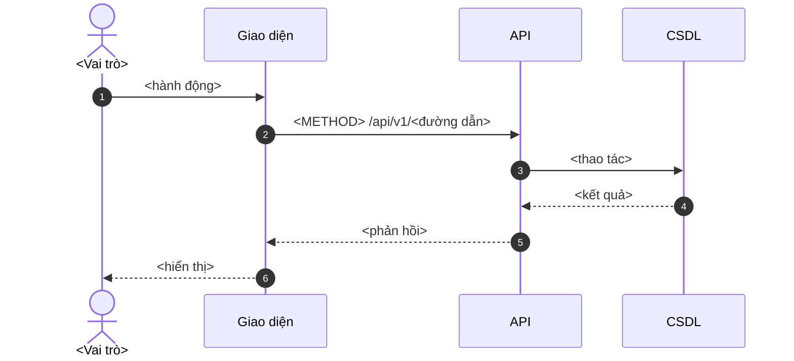

# TÀI LIỆU YÊU CẦU PHẦN MỀM (SRS): <TÊN PHÂN HỆ> (<DẢI MÃ TÍNH NĂNG>)

<!--
BIỂU MẪU CHUẨN — 7 MỤC CỐ ĐỊNH
Đọc trước: ../quy-uoc-BA.md §5
Quy tắc: đúng 7 tiêu đề cấp ##, đánh số 1. đến 7. Không thêm, không bớt, không đổi thứ tự.
Xoá toàn bộ comment HTML trước khi phát hành.

Từ 26/08/2026 biểu mẫu dùng nhãn tiếng Việt. Bản .docx in ra trước ngày đó còn nhãn
tiếng Anh (User Story · Acceptance Criteria · As a/I want to/So that · GIVEN/WHEN/THEN)
— NGHĨA KHÔNG ĐỔI, bảng đối chiếu ở ../quy-uoc-BA.md §5.2.
-->

## 1. THÔNG TIN QUẢN LÝ TÀI LIỆU

| Thông tin | Giá trị | Thông tin | Giá trị |
| :--- | :--- | :--- | :--- |
| **Tên dự án** | Hệ thống TracePro (NacenCheck) | **Mã tính năng** | `EPIC-<...>` (`<mã đầu>` → `<mã cuối>`) |
| **Mã tài liệu** | `SRS-<...>` | **Trạng thái** | DỰ THẢO / ĐANG RÀ SOÁT / ĐÃ DUYỆT |
| **Tác giả (BA)** | | **Phiên bản** | v1.0 |
| **Người duyệt** | | **Ngày cập nhật** | DD/MM/YYYY |
| **Đợt phát hành dự kiến** | | **Các bên liên quan** | |
| **Đối chiếu mã nguồn** | Ngày: DD/MM/YYYY · repo/commit: `<...>` · mức bằng chứng: M1/M2/M3 | **Phạm vi rà soát** | Màn hình / API / dữ liệu đã đối chiếu |

**Nhóm yêu cầu thuộc tài liệu này:** `REQ-XXX-001` … `REQ-XXX-0NN`
<!-- Bắt buộc. Đây là cầu nối tới Ma trận truy vết. -->

---

## 2. TỔNG QUAN & MỤC TIÊU NGHIỆP VỤ

### 2.1. Bối cảnh & bài toán nghiệp vụ

**Căn cứ pháp lý** <!-- Trích ĐÚNG điều khoản. Chỉ liệt kê văn bản THỰC SỰ chi phối phân hệ này — không copy nguyên danh sách 6 văn bản cho mọi tài liệu. -->

| Văn bản | Điều khoản | Nghĩa vụ phát sinh | Mã REQ |
| :--- | :--- | :--- | :--- |
| NĐ 37/2026/NĐ-CP | Điều __ khoản __ | | `REQ-...` |

**Chuẩn kỹ thuật áp dụng:** <!-- TCVN 13274 / 13275 / 12850 · GS1 GTIN-13/14, GLN, SSCC, SGTIN, EPCIS 2.0 · ISO/IEC 18975 (nhãn điện tử) -->

**Bài toán nghiệp vụ:**
<!-- 3-6 câu. Nêu khó khăn thực tế của người dùng, không mô tả giải pháp. -->

#### Ma trận liên kết phân hệ

| Phân hệ tiền đề (đầu vào) | Dữ liệu nhận vào | Phân hệ hạ nguồn (đầu ra) | Dữ liệu cung cấp |
| :--- | :--- | :--- | :--- |
| | | | |

### 2.2. Mục tiêu đo lường được (chỉ số KPI)

Bắt buộc đủ 3 nhóm dưới đây, mỗi nhóm có tối thiểu 2 chỉ số với **ngưỡng số**,
nguồn đo và chu kỳ đo:

**Nhóm 1 — Tuân thủ**

| Chỉ số | Ngưỡng | Nguồn đo | Chu kỳ |
| :--- | :--- | :--- | :--- |
| | | | |

**Nhóm 2 — Hiệu quả vận hành**

| Chỉ số | Ngưỡng | Nguồn đo | Chu kỳ |
| :--- | :--- | :--- | :--- |
| | | | |

**Nhóm 3 — Giảm rủi ro**

| Chỉ số | Ngưỡng | Nguồn đo | Chu kỳ |
| :--- | :--- | :--- | :--- |
| | | | |

### 2.3. Thuật ngữ, dữ liệu nguồn & giả định

<!-- Khai báo từ viết tắt, mã nghiệp vụ, hệ thống nguồn và giả định còn mở. Trường
     dữ liệu/sự kiện lấy từ hệ thống khác phải ghi rõ nguồn, chủ sở hữu và cơ chế
     cập nhật; không dùng các cụm mơ hồ như "hệ thống tự lấy". -->

| Thuật ngữ / dữ liệu | Diễn giải | Nguồn hoặc chủ sở hữu | Lưu ý áp dụng |
| :--- | :--- | :--- | :--- |
| | | | |

---

## 3. NHU CẦU NGƯỜI DÙNG & TIÊU CHÍ CHẤP NHẬN

<!-- Mỗi mã tính năng: 1 nhu cầu người dùng + tối thiểu 1 luồng thuận + 1 luồng lỗi.
     Câu thông báo lỗi phải ghi ĐÚNG nguyên văn hiển thị cho người dùng. -->

**Cách viết một dòng:**

- **Nhu cầu người dùng** — một câu, đúng mẫu: ***Là** \<vai trò\>, **tôi cần** \<làm được việc gì\>, **để** \<đạt được điều gì\>.*
  Thiếu vế **để** thì chưa rõ tính năng sinh ra để làm gì — chưa đạt.
- **Tiêu chí chấp nhận** — điều kiện để hai bên thống nhất là tính năng đã làm xong, viết thành kịch bản ba vế:
  **BỐI CẢNH** (đang ở tình huống nào) → **KHI** (người dùng thao tác gì) → **THÌ** (hệ thống phải phản hồi thế nào).
  Nối thêm điều kiện bằng **VÀ**.

| Mã tính năng | REQ | Nhu cầu người dùng | Tiêu chí chấp nhận |
| :--- | :--- | :--- | :--- |
| **`<mã>`** | `REQ-...` | **Là** persona `<P1–P4>` có vai trò `<vai trò hệ thống>`,<br>**tôi cần** <hành động>,<br>**để** <giá trị> | **Kịch bản 1 — <tên luồng thuận>**<br>- BỐI CẢNH …<br>- KHI …<br>- THÌ …<br><br>**Kịch bản 2 — <tên luồng lỗi>**<br>- BỐI CẢNH …<br>- KHI …<br>- THÌ hệ thống báo lỗi "<nguyên văn>" |

---

## 4. GIAO DIỆN MÀN HÌNH & LUỒNG XỬ LÝ

### 4.1. Thiết kế giao diện

<!-- Ảnh chụp màn hình thật từ tracepro-frontend/apps/. Nếu chưa có, ghi rõ:
     "⛳ CHƯA CÓ GIAO DIỆN — <lý do>" thay vì dùng ảnh của màn hình khác. -->

<!-- M1 = đọc mã nguồn tĩnh; M2 = có ảnh chụp thật, ghi ngày/môi trường; M3 = đã
     thao tác đầu-cuối, gồm nhánh lỗi. SRS ĐÃ DUYỆT chỉ dùng M2/M3, trừ khi nêu rõ
     lý do không thể chụp được. -->

| Mã UI | Mã tính năng / REQ | Tên màn hình | Đường dẫn thật | Vai trò được phép | Trạng thái màn hình | Mức bằng chứng | Ảnh / ngày / môi trường |
| :--- | :--- | :--- | :--- | :--- | :--- | :---: | :--- |
| `UI-...` | `F-...` / `REQ-...` | | `/...` | | Danh sách / tạo mới / xem / sửa / lỗi / rỗng | M1/M2/M3 | |

- **4.1.1. `<mã>` — <tên màn hình>**
  - **Mục đích và điểm vào:** <người dùng đến từ đâu, màn hình giúp hoàn thành việc gì>.
  - **Quyền và trạng thái:** <vai trò được xem/sửa; dữ liệu rỗng, đang tải, lỗi, không có quyền>.
  - Với form dài: chia thành các dải theo thứ tự cuộn; ảnh có callout `#01…#N` hiển thị **full-width**.
  
  *Phạm vi callout: `#01`–`#N`; bảng hợp đồng nằm ngay dưới ảnh.*

  | Callout | Nhãn / control | Tên trường kỹ thuật (DTO) · kiểu | Nguồn dữ liệu / tải | Bắt buộc | Ràng buộc | Lưu / lỗi / kiểm thử |
  | :--- | :--- | :--- | :--- | :---: | :--- | :--- |
  | `#01` | | | | | | |

<!-- Không đặt ảnh thu nhỏ cạnh cột chú giải và không tạo Field Notes tách riêng.
     Callout là mã duy nhất ở cột đầu; không lặp mã ACT/FLD. Nếu có nhiều ảnh/dải,
     lặp bộ “ảnh full-width → bảng hợp đồng” ngay sau từng ảnh. -->

### 4.2. Sơ đồ luồng xử lý

<!-- Sơ đồ tuần tự, vẽ bằng Mermaid. Mỗi mũi tên phải tương ứng một hàm / đường dẫn API thật ở mục 7.
     Nhánh rẽ đặt trong khối `alt`, KHÔNG trộn vào luồng chính. -->

#### 4.2.1. `<mã>` — <tên luồng>



**Tình huống lỗi cần xử lý:** <!-- tối thiểu: hết thời gian chờ · dữ liệu không hợp lệ · mất kết nối · không đủ quyền · xung đột đồng thời -->

| Mã lỗi | Điều kiện kích hoạt | Phản ứng hệ thống | Trạng thái cuối |
| :--- | :--- | :--- | :--- |
| FM-1 | | | |

---

## 5. YÊU CẦU CHỨC NĂNG & QUY TẮC NGHIỆP VỤ

### 5.1. Quy tắc nghiệp vụ

| Mã quy tắc | Quy tắc | Căn cứ | Xử lý khi vi phạm |
| :--- | :--- | :--- | :--- |
| BR-01 | | | Chặn / Cảnh báo / Ghi nhật ký |

### 5.2. Ma trận kiểm tra dữ liệu

| Mã tính năng | Trường dữ liệu | Ràng buộc kỹ thuật | Thông báo lỗi hiển thị |
| :--- | :--- | :--- | :--- |
| | | | |

### 5.3. Từ điển trường giao diện không có ảnh callout

<!-- Chỉ dùng bảng này cho màn hình không có ảnh callout M2. Với màn hình form đã
     có ảnh callout, toàn bộ hợp đồng trường đặt ngay dưới đúng ảnh ở 4.1; không
     sao chép lại tại đây. Màn hình chỉ hiển thị dữ liệu vẫn phải khai các trường
     Textview; nếu không có trường ghi "không áp dụng" và nêu lý do. -->

| Mã UI | Nhãn hiển thị | Tên trường kỹ thuật (DTO) | Kiểu dữ liệu | Bắt buộc | Ràng buộc | Thông báo lỗi |
| :--- | :--- | :--- | :--- | :---: | :--- | :--- |
| | | | | | | |

### 5.4. Vòng đời thao tác và hồ sơ màn hình không có ảnh callout

<!-- Với màn hình đã có callout M2 tại 4.1, mục này chỉ mô tả vòng đời toàn form;
     không lặp từng trường. Với màn hình không có callout, phần này giúp người đọc biết một trường hiển thị
     gì, lấy từ đâu, nhập/chọn thế nào, phụ thuộc vào gì và hệ thống phản hồi ra sao
     mà không phải mở thiết kế hay hỏi BA. Lặp lại khối cho từng màn hình. Mỗi
     trường, cột bảng, bộ lọc, nút, liên kết, trạng thái rỗng và thao tác hàng loạt
     là một dòng; không dùng "..." hay "tương tự" để bỏ qua hành vi. -->

#### 5.4.1. `UI-...` — <tên màn hình>

**Phạm vi:** <danh sách / tạo mới / xem / chỉnh sửa / popup>.

**Dữ liệu nguồn và thời điểm tải:** <API, bảng dữ liệu, hệ thống ngoài; tải lúc mở / đổi bộ lọc / bấm nút>.

**Trạng thái chung:** <đang tải, rỗng, lỗi tải, không có quyền, xung đột đồng thời>.

| Mã | Thành phần / nhãn | Mục đích & dữ liệu hiển thị | Kiểu tương tác | Nguồn dữ liệu / cách cập nhật | Giá trị mặc định, định dạng & tập giá trị | Bắt buộc / quyền sửa / điều kiện hiển thị | Ràng buộc & thông báo lỗi nguyên văn | Phụ thuộc, hành vi khi thao tác & kết quả |
| :--- | :--- | :--- | :--- | :--- | :--- | :--- | :--- | :--- |
| `UI-...-01` | `<Nhãn>` | <người dùng thấy/nhập gì, ý nghĩa nghiệp vụ> | Textbox / Combobox / DatePicker / Checkbox / Textview / Button / Link / bảng | <API, DTO, dữ liệu tính, nhập tay; tự tải/cập nhật lúc nào> | <mặc định; `dd/MM/yyyy`; danh sách mã–diễn giải; ví dụ> | Có/Không; <vai trò>; <chỉ hiện khi…; readonly khi…> | <required, độ dài, regex, khoảng giá trị, trùng lặp; "Thông báo lỗi"> | <đổi A thì B; click/nút điều hướng/xác nhận; lưu/chặn/refresh; sự kiện kiểm toán> |

<!-- Với bảng danh sách, thêm dòng cho: từng cột, tìm kiếm, bộ lọc, sắp xếp, phân
     trang, chọn bản ghi, cấu hình cột, export/import và từng nút. Với biểu mẫu,
     thêm mọi trường, Lưu/Hủy/Xóa, xác nhận bỏ thay đổi chưa lưu và kết quả thành
     công/thất bại. -->

### 5.5. Ma trận chuẩn hóa câu chữ giao diện

<!-- Dùng cho màn hình có biểu mẫu hoặc luồng nghiệp vụ quan trọng. Mục tiêu là
     khóa đúng câu chữ mà người dùng nhìn thấy, tránh nhãn mơ hồ, thuật ngữ không
     nhất quán và thông báo lỗi không chỉ ra cách xử lý. -->

| Mã UI | Loại câu chữ | Câu chữ hiển thị | Bối cảnh hiển thị | Quy tắc biên tập / lý do | Trạng thái xác nhận |
| :--- | :--- | :--- | :--- | :--- | :--- |
| `UI-...-01` | Nhãn / gợi ý / thông báo lỗi / xác nhận / trạng thái rỗng | | | <ngắn gọn, nhất quán thuật ngữ, chỉ ra hành động tiếp theo> | Bản nháp / Đã xác nhận |

---

## 6. YÊU CẦU PHI CHỨC NĂNG

Đủ 5 trụ, mỗi mục phải có **ngưỡng đo được**:

| Trụ | Yêu cầu | Ngưỡng | Cách đo |
| :--- | :--- | :--- | :--- |
| **Hiệu năng** | | | |
| **Bảo mật** | | | |
| **Khả năng kiểm toán** | | | |
| **Khả năng liên thông** | | | |
| **Độ sẵn sàng** | | | |

<!-- Nếu có dữ liệu cá nhân/nhạy cảm, khai phân quyền xem, che/mã hóa, thời hạn lưu
     và xóa/ẩn dữ liệu trong trụ Bảo mật. Nếu có tích hợp, nêu timeout, retry,
     idempotency và cảnh báo thất bại trong trụ Liên thông. -->

---

## 7. THAM CHIẾU KỸ THUẬT & ĐẶC TẢ GIAO DIỆN LẬP TRÌNH (API)

### 7.1. Bảng đường dẫn API

<!-- Cột "Trạng thái mã nguồn" bắt buộc kèm đường dẫn file + số dòng khi ghi [ĐÃ CÓ TRONG MÃ NGUỒN]. -->

| Mã tính năng | Phương thức | Đường dẫn | Cần đăng nhập | Trạng thái mã nguồn | Bằng chứng |
| :--- | :--- | :--- | :--- | :--- | :--- |
| | | | | `[ĐÃ CÓ TRONG MÃ NGUỒN]` / `[MỚI THIẾT KẾ — CHƯA LẬP TRÌNH]` | `đường/dẫn.go:123` |

<!-- Mỗi đường dẫn khai thêm ngay sau bảng nếu có: mã HTTP thành công/lỗi, phân
     trang-lọc-sắp xếp, idempotency, giới hạn tần suất và quy tắc phân quyền. Không
     suy diễn API từ giao diện. -->

### 7.2. Mẫu dữ liệu trao đổi

#### Phần A — Đường dẫn đã có (trích từ mã nguồn hoặc hành vi API hiện tại)

```json
{ }
```

#### Phần B — Đường dẫn mới thiết kế (chưa lập trình)

```json
{ }
```

### 7.3. Tài liệu tham chiếu

| Loại | Đường dẫn |
| :--- | :--- |
| Quyết định kiến trúc (ADR) | `../../../tracepro-docs/08-references/adr/...` |
| Sơ đồ tuần tự gốc | `../../../tracepro-docs/04-technical/architecture/sequence-diagrams/...` |
| Từ điển dữ liệu | `../../05-DU-LIEU/...` |

---

### 7.4. Danh mục tự kiểm trước khi chuyển trạng thái ĐÃ DUYỆT

- [ ] Đúng 7 tiêu đề cấp `##`, đánh số 1. → 7.
- [ ] Mục 1 có danh sách mã `REQ-*` thuộc tài liệu
- [ ] Mục 2.1 trích **đúng điều khoản**, không trích chung chung
- [ ] Mục 2.2 đủ 3 nhóm chỉ số, mỗi chỉ số có ngưỡng số
- [ ] Mục 3 mỗi tính năng có ≥1 kịch bản thuận + ≥1 kịch bản lỗi, câu báo lỗi ghi nguyên văn
- [ ] Mục 3 mỗi nhu cầu người dùng đủ ba vế **Là … tôi cần … để …**
- [ ] Mục 4.1 dùng ảnh **đúng màn hình** hoặc ghi rõ chưa có — không tái sử dụng ảnh màn hình khác
- [ ] Mục 4.1 mọi màn hình có mã UI, đường dẫn thật, vai trò, trạng thái và mức bằng chứng M1/M2/M3
- [ ] Mục 4.2 mỗi mũi tên tương ứng một đường dẫn API ở mục 7
- [ ] Mục 4.2 có bảng tình huống lỗi, phủ đủ 5 loại lỗi chuẩn
- [ ] Mục 5.4 mô tả từng trường/cột/nút: mục đích, nguồn, mặc định/định dạng/tập giá trị, quyền/điều kiện hiển thị, ràng buộc/lỗi, phụ thuộc và kết quả thao tác
- [ ] Mục 5.5 xác nhận câu chữ cho nhãn, gợi ý, trạng thái rỗng và thông báo lỗi của các màn hình có biểu mẫu/luồng quan trọng
- [ ] Mục 6 đủ 5 trụ, mọi ngưỡng đều đo được
- [ ] Mục 7 mọi dòng `[ĐÃ CÓ TRONG MÃ NGUỒN]` đều kèm đường dẫn + số dòng
- [ ] Mọi `REQ-*` đã được thêm vào Ma trận truy vết
