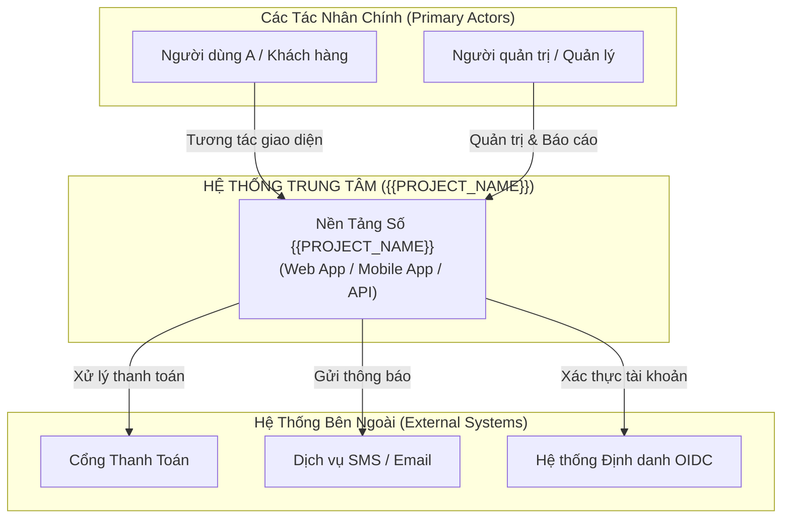
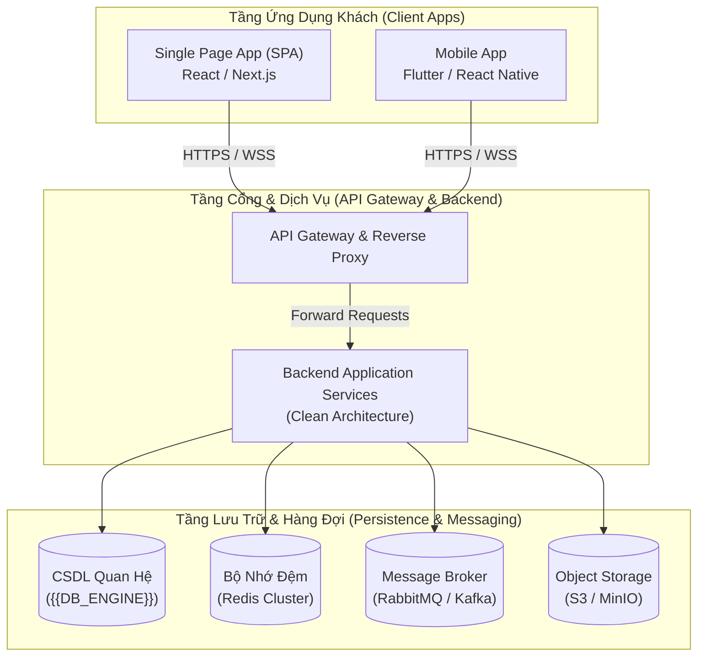
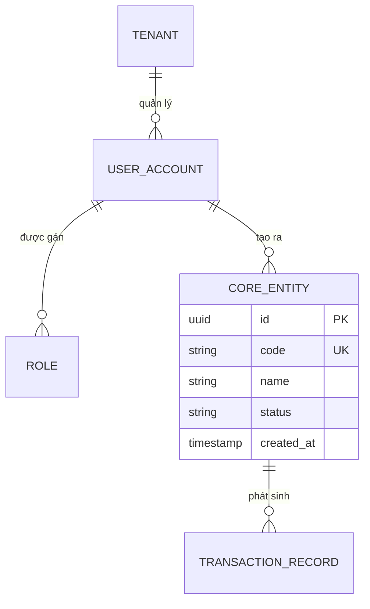

# TÀI LIỆU THIẾT KẾ CƠ SỞ (BASIC DESIGN DOCUMENT — KIHON SEKKEI)

*Mã tài liệu: `BD-{{PROJECT_CODE}}-001` | Dự án: `{{PROJECT_NAME}}` | Phiên bản: `v1.0.0` | Ngày: `{{DATE}}`*  
*Vai trò biên soạn: Product Owner & Lead Business Analyst*  
*Tình trạng: [DỰ THẢO / ĐÃ THỐNG NHẤT / PHÊ DUYỆT]*

---

> [!NOTE]
> **HƯỚNG DẪN DÀNH CHO PO & LEAD BA**:
> - Tài liệu này là **Bản Thiết Kế Cơ Sở (Basic Design - Kihon Sekkei)**, đóng vai trò **Bộ Khung Xương Sống (Product Backbone)** cho toàn bộ dự án.
> - **Nguyên tắc vàng**: Viết ngắn gọn, súc tích, tập trung vào cấu trúc tổng thể, dòng giá trị, ranh giới hệ thống và các khối chức năng lõi.
> - **TUYỆT ĐỐI KHÔNG** sa đà vào chi tiết trường thông tin (field validation), giao diện chi li từng nút bấm, hay câu lệnh SQL/API endpoint (các phần này thuộc phạm vi tài liệu SRS 7 mục và Detail Design).

---

## 1. TỔNG QUAN HỆ THỐNG & TẦM NHÌN CHIẾN LƯỢC (EXECUTIVE SUMMARY & VISION)

### 1.1. Bối cảnh & Bài toán Cốt lõi (The Problem)
- **Nỗi đau 1**: [Mô tả nỗi đau / bài toán số 1 của người dùng]
- **Nỗi đau 2**: [Mô tả nỗi đau / bài toán số 2]
- **Nỗi đau 3**: [Mô tả nỗi đau / bài toán số 3]

### 1.2. Tuyên ngôn Tầm nhìn Sản phẩm (Product Vision Statement)
> *Dành cho* **[{{ĐỐI_TƯỢNG_NGƯỜI_DÙNG_MỤC_TIÊU}}]**,  
> *Hệ thống {{PROJECT_NAME}}* là **[{{LOẠI_HÌNH_HỆ_THỐNG / NỀN_TẢNG}}]**,  
> *Giúp* **[{{GIẢI_QUYẾT_VẤN_ĐỀ_GÌ / LỢI_ÍCH_CỐT_LÕI}}]**,  
> *Khác biệt với* các giải pháp thông thường nhờ **[{{ĐIỂM_KHÁC_BIỆT_CẠNH_TRANH}}]**.

### 1.3. Ranh giới Phạm vi Dự án (System Boundaries: In-Scope vs Out-of-Scope)
| Khu vực | Trong phạm vi (In-Scope - Hệ thống đảm nhiệm) | Ngoài phạm vi (Out-of-Scope - Tích hợp bên ngoài / Giai đoạn sau) |
| :--- | :--- | :--- |
| **Phân hệ 1** | [Chức năng trong phạm vi] | [Chức năng ngoài phạm vi] |
| **Phân hệ 2** | [Chức năng trong phạm vi] | [Chức năng ngoài phạm vi] |
| **Phân hệ 3** | [Chức năng trong phạm vi] | [Chức năng ngoài phạm vi] |

---

## 2. KIẾN TRÚC TỔNG THỂ HỆ THỐNG (C4 ARCHITECTURE BLUEPRINT)

### 2.1. C4 Level 1: Sơ đồ Ngữ cảnh Hệ thống (System Context Diagram)

### 2.2. C4 Level 2: Sơ đồ Khối Container (Container Diagram)

---

## 3. MÔ HÌNH MIỀN DỮ LIỆU TỔNG THỂ (DOMAIN MODEL & BOUNDED CONTEXTS)

---

## 4. BẢN ĐỒ HÀNH TRÌNH NGƯỜI DÙNG & STORY MAPPING (USER JOURNEYS)

### 4.1. Khung Xương Sống Hoạt Động (Activity Backbone)
$$\text{Khám phá / Tiếp cận} \longrightarrow \text{Đăng ký / Xác thực} \longrightarrow \text{Thực hiện Giao dịch chính} \longrightarrow \text{Xử lý & Hoàn tất} \longrightarrow \text{Đánh giá & Báo cáo}$$

### 4.2. Lát Cắt Mỏng Ban Đầu (Walking Skeleton)
- Định nghĩa luồng mỏng nhất chạy thông từ Frontend qua API xuống CSDL ngay từ Sprint 1:
  1. Người dùng mở trang web/app.
  2. Đăng ký/Đăng nhập và nhận Token.
  3. Tạo 1 bản ghi nghiệp vụ mẫu.
  4. Hệ thống lưu thành công vào CSDL và phản hồi `200 OK`.

---

## 5. PHÂN RÃ SANG SRS CHI TIẾT (DECOMPOSITION TO SRS)

| Mã Phân Hệ | Tên Phân Hệ | File SRS Tương Ứng | Agent Phụ Trách |
| :--- | :--- | :--- | :--- |
| **MOD-01** | Quản trị Định danh & Phân quyền | `specs/EPIC-01-IAM/spec.md` | BA Agent (`ba-srs`) |
| **MOD-02** | [Phân hệ nghiệp vụ cốt lõi 1] | `specs/EPIC-02-CORE/spec.md` | BA Agent (`ba-srs`) |
| **MOD-03** | [Phân hệ nghiệp vụ cốt lõi 2] | `specs/EPIC-03-EXT/spec.md` | BA Agent (`ba-srs`) |
