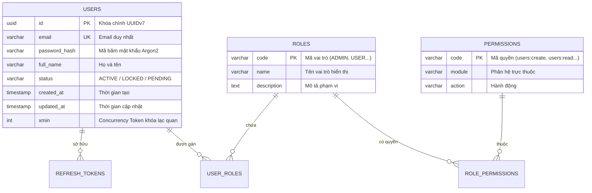

# TÀI LIỆU THIẾT KẾ CHI TIẾT CSDL & ERD (DATABASE DETAIL DESIGN)

*Mã tài liệu: `DD-01-DATABASE-ERD` | Dự án: `{{PROJECT_NAME}}` | CSDL: `{{DB_ENGINE}}`*

---

## 1. SƠ ĐỒ QUAN HỆ THỰC THỂ (ENTITY RELATIONSHIP DIAGRAM)

---

## 2. TỪ ĐIỂN DỮ LIỆU CHI TIẾT (DATA DICTIONARY)

### Bảng 1: `users` (Thông tin tài khoản người dùng)
- **Mã định danh**: `DB-TBL-USERS`
- **Mục đích**: Lưu trữ thông tin đăng nhập và hồ sơ người dùng.
- **Chiến lược khóa**: Khóa lạc quan qua trường `xmin` (PostgreSQL) hoặc `RowVersion`.

| Tên Cột | Kiểu Dữ Liệu | Nullable | Khóa | Mặc Định | Mô Tả & Ràng Buộc |
| :--- | :--- | :---: | :---: | :--- | :--- |
| `id` | `UUID` | NO | PK | `gen_random_uuid()` | Khóa chính ngẫu nhiên |
| `email` | `VARCHAR(255)` | NO | UK | Không | Email người dùng (Chữ thường, duy nhất) |
| `password_hash`| `VARCHAR(255)` | NO | Không | Không | Chuỗi băm mật khẩu Bcrypt / Argon2id |
| `full_name` | `VARCHAR(150)` | NO | Không | Không | Họ tên đầy đủ |
| `phone_number` | `VARCHAR(20)` | YES | Không | NULL | Số điện thoại chuẩn E.164 |
| `status` | `VARCHAR(20)` | NO | Không | `'ACTIVE'` | Trạng thái: ACTIVE, LOCKED, DELETED |
| `created_at` | `TIMESTAMPTZ` | NO | Không | `CURRENT_TIMESTAMP` | Thời điểm tạo bản ghi |
| `updated_at` | `TIMESTAMPTZ` | NO | Không | `CURRENT_TIMESTAMP` | Thời điểm cập nhật cuối |

### Chiến Lược Đánh Chỉ Mục (Indexes Strategy):
1. `idx_users_email` (UNIQUE B-Tree): Tối ưu tìm kiếm đăng nhập theo email (`WHERE email = ?`).
2. `idx_users_status_created` (Composite B-Tree): Tối ưu lọc danh sách người dùng theo trạng thái và thời gian.

---

## 3. QUY ƯỚC QUẢN LÝ MIGRATION
- Mọi thay đổi schema đều phải qua migration file: `V[YYYYMMDD_HHMMSS]__[Mo_Ta_Ngan_Gon].sql`.
- Nghiêm cấm dùng lệnh phá hủy (`DROP COLUMN`, `RENAME COLUMN`) trong giờ cao điểm; tuân thủ quy trình Expand & Contract.
