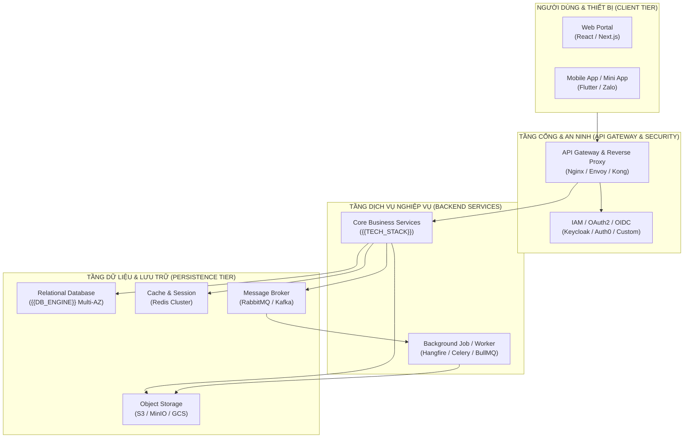

# HỒ SƠ ĐỀ XUẤT GIẢI PHÁP KỸ THUẬT (IT TECHNICAL PROPOSAL)

*Dự án: `{{PROJECT_NAME}}` | Khách hàng: `{{CLIENT_NAME}}` | Phiên bản: `v1.0.0` | Ngày lập: `{{DATE}}`*  
*Đơn vị tư vấn: `{{CONSULTING_TEAM}}` | Chuyên gia tư vấn (PS): `{{PS_CONSULTANT_NAME}}`*

---

## 1. TÓM LƯỢC ĐIỀU HÀNH (EXECUTIVE SUMMARY)
- **Bối cảnh kinh doanh**: [Mô tả ngắn gọn bối cảnh và lý do khách hàng cần hệ thống này]
- **Nỗi đau then chốt (Key Pain Points)**:
  1. [Nỗi đau 1: Ví dụ quy trình thủ công chậm chạp]
  2. [Nỗi đau 2: Dữ liệu phân tán, thiếu báo cáo thời gian thực]
  3. [Nỗi đau 3: Hệ thống cũ không đáp ứng được tải lớn]
- **Tuyên ngôn giải pháp (Proposed Value Proposition)**: [Đề xuất giải pháp công nghệ toàn diện giúp tự động hóa, tăng tốc độ xử lý lên X% và tiết kiệm Y% chi phí]
- **Kết quả định lượng kỳ vọng (Target ROI & KPIs)**:
  - Tối ưu thời gian xử lý: [Giảm từ X ngày xuống Y phút]
  - Khả năng phục vụ đồng thời: [Tối thiểu X,000 người dùng]
  - Hoàn vốn đầu tư (ROI): [Dự kiến trong X tháng]

---

## 2. BẢN VẼ KIẾN TRÚC TỔNG THỂ (C4 ARCHITECTURE BLUEPRINT)

### Công Nghệ Đề Xuất (Recommended Tech Stack)
| Thành Phần | Công Nghệ Lựa Chọn | Lý Do Lựa Chọn (Rationals) |
| :--- | :--- | :--- |
| **Frontend Web** | React 19 / Next.js 15 / TypeScript | Tốc độ cao, SEO tốt, hệ sinh thái phong phú |
| **Mobile / Mini App** | Flutter / React Native / Zalo Mini App | Đa nền tảng, tiết kiệm 40% chi phí phát triển |
| **Backend Core** | .NET 9 Clean Architecture / Node.js / Go | Hiệu năng cực cao, an toàn kiểu dữ liệu, dễ mở rộng |
| **Database** | PostgreSQL 16+ Multi-AZ | Hỗ trợ JSONB linh hoạt, ACID chuẩn, chi phí tối ưu |
| **Cache & Real-time** | Redis Cluster + WebSockets | Xử lý hàng triệu request/s, độ trễ < 5ms |
| **Cloud Hosting** | AWS / Google Cloud / Local DC | Sẵn sàng mở rộng tự động (Auto-scaling), SLA 99.9% |

---

## 3. PHÂN RÃ CÁC PHÂN HỆ CHỨC NĂNG (CORE MODULES WBS)
1. **Phân Hệ 1: Quản Trị Người Dùng & Phân Quyền (`IAM`)**:
   - Xác thực đa yếu tố (MFA), phân quyền theo vai trò (Scoped RBAC).
2. **Phân Hệ 2: Nghiệp Vụ Cốt Lõi (`CORE`)**:
   - [Mô tả phân hệ nghiệp vụ chính của dự án]
3. **Phân Hệ 3: Báo Cáo & Bảng Điều Khiển (`DASHBOARD`)**:
   - Báo cáo phân tích thời gian thực, biểu đồ trực quan.
4. **Phân Hệ 4: Tích Hợp Hệ Thống Bên Thứ Ba (`INTEGRATION`)**:
   - Cổng thanh toán, Hóa đơn điện tử, SMS/Email OTP.

---

## 4. YÊU CẦU PHI CHỨC NĂNG & TIÊU CHUẨN AN TOÀN (NFR & SECURITY)
- **Hiệu năng**: Thời gian phản hồi API trung bình < 200ms cho 95% request (p95).
- **Tính sẵn sàng**: Cam kết SLA 99.9% thời gian hoạt động.
- **Bảo mật**: Mã hóa dữ liệu đường truyền (TLS 1.3), mã hóa dữ liệu tĩnh (AES-256), chống tấn công SQLi, XSS, CSRF, DDoS qua Cloudflare WAF.
- **Sao lưu & Phục hồi**: Tự động sao lưu dữ liệu mỗi 24h, RPO < 1 giờ, RTO < 4 giờ.

---

## 5. LỘ TRÌNH TRIỂN KHAI DỰ ÁN (PROJECT TIMELINE)
- **Giai đoạn 1 (Tuần 1 - Tuần 2)**: Khởi động dự án, Basic Design & Walking Skeleton.
- **Giai đoạn 2 (Tuần 3 - Tuần X)**: Phát triển phiên bản tối thiểu (MVP Core).
- **Giai đoạn 3 (Tuần X+1 - Tuần Y)**: Tích hợp, Kiểm thử 3 tầng & Fuzzing bảo mật.
- **Giai đoạn 4 (Tuần Y+1)**: UAT khách hàng nghiệm thu và Triển khai Production.

---

## 6. DỰ TOÁN ĐẦU TƯ TỔNG QUAN (INVESTMENT OVERVIEW)
- Chi tiết bóc tách khối lượng và chi phí xem tại: [`docs/00-presale-proposal/ESTIMATION_AND_COST.md`](ESTIMATION_AND_COST.md)
- So sánh các phương án đầu tư xem tại: [`docs/00-presale-proposal/SOLUTION_COMPARISON.md`](SOLUTION_COMPARISON.md)

---

## 7. ĐÁNH GIÁ RỦI RO & PHƯƠNG ÁN KIỂM SOÁT
| Nhóm Rủi Ro | Mô Tả Rủi Ro | Mức Độ | Giải Pháp Phòng Ngừa |
| :--- | :--- | :---: | :--- |
| **Công nghệ** | Tích hợp API bên thứ ba phản hồi chậm | Vừa | Áp dụng cơ chế Timeout, Circuit Breaker và Queue bất đồng bộ |
| **Phạm vi** | Khách hàng phát sinh thay đổi nhiều | Cao | Áp dụng quy trình chuẩn `wf-delta` (Tài liệu đi trước, Code theo sau) |
| **Nhân sự** | Tiến độ gấp rút | Vừa | Tận dụng khung tự động hóa TC IT Agent để tăng tốc độ phát triển |
