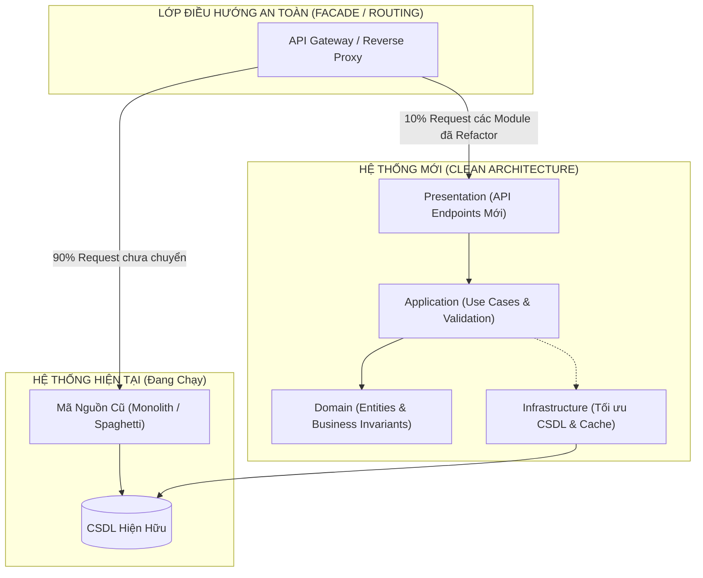

# ĐỀ XUẤT GIẢI PHÁP TÁI CẤU TRÚC HỆ THỐNG (SYSTEM REFACTORING & MODERNIZATION PROPOSAL)

*Dự án: `{{PROJECT_NAME}}` | Ngày thẩm định: `{{DATE}}`*  
*Đơn vị đánh giá: TC IT Architecture Board | Tác tử chủ trì: TL/SA Agent & PS Agent*

---

## 1. TÓM TẮT ĐIỀU HÀNH (EXECUTIVE SUMMARY)
- **Mục tiêu**: Nâng cấp toàn diện kiến trúc hệ thống hiện tại sang chuẩn Clean Architecture / Modular Monolith nhằm:
  - Tăng tốc độ phát triển tính năng mới lên **X%**.
  - Giảm thiểu thời gian gỡ lỗi và sự cố vận hành (Bugs & Incidents) xuống **Y%**.
  - Tối ưu chi phí hạ tầng và nâng cao khả năng chịu tải lên gấp **Z lần**.
- **Cam kết vàng (Non-Negotiable Guarantee)**:
  - **100% Không làm gián đoạn** hoạt động kinh doanh hiện tại của hệ thống cũ.
  - **100% Không làm sai khác hay mất mát** dữ liệu nghiệp vụ đã có.
  - Áp dụng mô hình chuyển đổi từng phần (**Strangler Fig Pattern**), kiểm thử an toàn trước khi thay thế.

---

## 2. ĐÁNH GIÁ NỢ KỸ THUẬT HIỆN TRẠNG (AS-IS TECHNICAL DEBT)

| Tiêu Chí Đánh Giá | Hiện Trạng Hệ Thống Cũ | Rủi Ro Kinh Doanh & Kỹ Thuật | Điểm Đánh Giá (1 - 5) |
| :--- | :--- | :--- | :---: |
| **Kiến trúc & Ranh giới** | Code bị trộn lẫn giữa UI, Logic và SQL (Spaghetti) | Khó sửa lỗi, sửa chỗ này gãy chỗ khác | 2/5 (Kém) |
| **Hiệu năng CSDL** | Nhiều truy vấn N+1 query, thiếu Index trên bảng lớn | Hệ thống bị đơ/nghẽn khi người dùng tăng | 2.5/5 |
| **Khớp nối (Coupling)** | Các module phụ thuộc vòng tròn, God Classes > 1,500 dòng | Không thể bàn giao hoặc mở rộng team dev | 2/5 |
| **Kiểm thử tự động** | Hầu như không có Unit Test hay Integration Test (0%) | Mỗi lần release đều phải test tay tốn kém, dễ sót bug | 1/5 (Báo động) |
| **Bảo mật & Secrets** | Hardcoded chuỗi kết nối, thiếu kiểm tra phân quyền chặt | Nguy cơ rò rỉ dữ liệu hoặc tấn công nội bộ | 2.5/5 |

---

## 3. KIẾN TRÚC MỤC TIÊU ĐỀ XUẤT (TO-BE ARCHITECTURE)

---

## 4. CHIẾN LƯỢC CHUYỂN ĐỔI TỪNG PHẦN (STRANGLER FIG MIGRATION)

1. **Giai Đoạn 1: Lập Lưới Bảo Vệ An Toàn (Safety Net Integration Tests)**:
   - Viết các test case đầu cuối cho các API/luồng quan trọng nhất của hệ thống cũ.
   - Khi chạy test xanh 100%, lưới an toàn này sẽ dùng để đối chiếu kết quả của code mới.
2. **Giai Đoạn 2: Trích Xuất & Chuẩn Hóa Lõi Nghiệp Vụ (Core Domain Extraction)**:
   - Tái cấu trúc từng phân hệ độc lập (bắt đầu từ phân hệ ít rủi ro nhất).
   - Tách riêng Domain Entities và Business Rules sang tầng mới.
3. **Giai Đoạn 3: Triển Khai Song Song & Xác Minh (Canary Run & Verification)**:
   - Cho cả code cũ và code mới cùng xử lý dữ liệu và so sánh kết quả ngầm (Shadow Traffic / Dark Launch).
   - Đảm bảo kết quả đầu ra khớp nhau 100%.
4. **Giai Đoạn 4: Chuyển Hướng Chính Thức & Vô Hiệu Hóa Code Cũ (Cutover & Clean Up)**:
   - Chuyển hướng lưu lượng người dùng sang module mới.
   - Xóa bỏ code cũ an toàn, dọn sạch nợ kỹ thuật.

---

## 5. DỰ TOÁN NỖ LỰC & SO SÁNH HIỆU QUẢ ĐẦU TƯ (COST-BENEFIT ANALYSIS)

| Hạng Mục Refactor | Nỗ Lực (Man-Month) | Lợi Ích Mang Lại |
| :--- | :---: | :--- |
| **1. Lưới kiểm thử tự động (Safety Net)** | 0.8 MM | Ngăn ngừa 100% rủi ro hỏng hóc nghiệp vụ cũ |
| **2. Tái cấu trúc CSDL & Tối ưu Index** | 0.5 MM | Tăng tốc độ truy vấn từ 3s xuống < 150ms |
| **3. Chuẩn hóa Phân hệ 1 (Core)** | 1.2 MM | Tách rời module, dễ bảo trì và mở rộng |
| **4. Chuẩn hóa Phân hệ 2** | 1.0 MM | Giảm 70% số lỗi phát sinh khi thêm tính năng |
| **TỔNG NỖ LỰC DỰ TOÁN** | **~3.5 Man-Month** | **Hệ thống mới đạt chuẩn vận hành 3 - 5 năm tới** |
