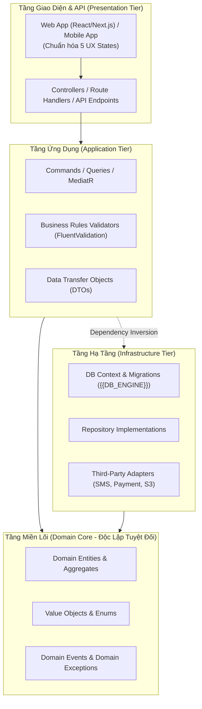

# HIẾN PHÁP KỸ THUẬT DỰ ÁN (PROJECT CONSTITUTION) — DỰ ÁN {{PROJECT_NAME}}

*Phiên bản: `v2.0.0-Enterprise` | Phạm vi áp dụng: Toàn bộ thành viên, AI Agents, Tài liệu và Mã nguồn dự án*

---

## 1. NGUYÊN TẮC BẤT BIẾN TỐI CAO (NON-NEGOTIABLE CORE INVARIANTS)

1. **Tuyệt Đối Không Đoán Mò (Zero Hallucination - Zero Assumption)**:
   - Mọi thông tin nghiệp vụ, quy tắc tính toán hoặc cấu trúc dữ liệu bắt buộc phải được gắn 1 trong 3 nhãn chứng cứ:
     - `[VERIFIED]`: Đã có chứng cứ xác thực từ tài liệu gốc, hợp đồng, schema CSDL hoặc mã nguồn thực tế (kèm dẫn chứng dòng/file cụ thể).
     - `[CONFIRMED]`: Đã được Product Owner / Khách hàng trực tiếp xác nhận trong phiên làm việc.
     - `[PROPOSAL]`: Đề xuất suy luận của AI Agent. Tuyệt đối không tự ý coi là sự thật ngầm định nếu chưa được chuyển sang `[CONFIRMED]`.
2. **Khung Xương Sống Đi Trước (Architecture & Backbone First)**:
   - Trước khi bẻ nhỏ và đào sâu vào từng module chi tiết, toàn bộ dự án bắt buộc phải có bản **Thiết Kế Cơ Sở (Basic Design - `docs/01-basic-design/`)** đóng vai trò khung xương sống: định hình C4 Architecture, Story Mapping Backbone, Walking Skeleton và Domain Model.
3. **Kỷ Luật Thư Mục Chống Rác (Zero-Tolerance Root Dumping)**:
   - Nghiêm cấm tạo bất kỳ file nháp `.md`, file code `.js/.ts/.py`, log hoặc script tạm vứt ở thư mục gốc (`root`).
   - Mọi tài liệu và code bắt buộc phải lưu đúng địa chỉ theo Bảng Điều Hướng Thư Mục chuẩn (Directory Routing Matrix).
4. **Tài Liệu Đi Trước, Code Theo Sau (Spec-First Anti-Drift)**:
   - Khi có yêu cầu thay đổi (CR), tuyệt đối không được sửa code ngay. Bắt buộc phải cập nhật tài liệu Thiết kế Cơ sở và Chi tiết trước, sinh task delta, sau đó mới thực thi mã nguồn.

---

## 2. RANH GIỚI KIẾN TRÚC & PHÂN TẦNG CLEAN ARCHITECTURE

- **Quy tắc ranh giới bất biến**:
  - `Domain` không tham chiếu bất kỳ thư viện bên ngoài hay tầng nào khác.
  - `Presentation` không được gọi trực tiếp `DbContext` hay các Adapter hạ tầng cụ thể; mọi tương tác phải qua Use Case / Interface.

---

## 3. QUY CHUẨN ĐỊNH DANH TRUY VẾT KHÉP KÍN (TRACEABILITY SCHEMA)

Tất cả các thực thể trong tài liệu đặc tả, kế hoạch, mã nguồn và kiểm thử phải tuân thủ chuẩn tiền tố sau:

| Tiền Tố | Định Nghĩa Thực Thể | Cú Pháp Chuẩn | Ví Dụ Cụ Thể |
| :---: | :--- | :--- | :--- |
| **`REQ-`** | Yêu cầu nghiệp vụ / chức năng người dùng | `REQ-[MODULE]-[STT]` | `REQ-AUTH-001`, `REQ-CART-002` |
| **`BR-`** | Quy tắc nghiệp vụ bắt buộc tuân thủ | `BR-[MODULE]-[STT]` | `BR-AUTH-001`, `BR-PAY-003` |
| **`DB-`** | Bảng CSDL / Trường dữ liệu / Khóa | `DB-[TBL/COL]-[TÊN]` | `DB-TBL-USERS`, `DB-COL-PASSWORD` |
| **`API-`** | Điểm cuối giao diện lập trình ứng dụng | `API-[MODULE]-[STT]` | `API-AUTH-LOGIN`, `API-CART-ADD` |
| **`UI-`** | Màn hình giao diện / Khối component | `UI-[MODULE]-[TÊN]` | `UI-AUTH-LOGIN-FORM`, `UI-CART-DRAWER` |
| **`AC-`** | Tiêu chí nghiệm thu (Acceptance Criteria)| `AC-[EPIC]-[STT]` | `AC-AUTH-001`, `AC-CART-002` |

---

## 4. CHUẨN MỰC CHẤT LƯỢNG ĐẦU RA (QUALITY GATES)

- **Gate 1 (Nghiệp vụ)**: Basic Design và `spec.md` đạt chuẩn 7 mục, 100% tiêu chí AC có mã hóa, được PO/PM ký duyệt.
- **Gate 2 (Kiến trúc)**: `plan.md` phân tầng Clean Architecture, schema CSDL `DB-*`, hợp đồng API `API-*`, và `sa-analyze` PASS.
- **Gate 3 (Code Review)**: TL/SA duyệt đối kháng qua `pr-review-guard` (6 trục kiểm soát: Clean Architecture, Schema phi phá hủy, Scoped RBAC, Concurrency, UX 5 States, Unit Test).
- **Gate 4 (Kiểm định)**: EC Agent kiểm thử 3 tầng đạt 100% Green (Unit, Integration, Playwright E2E), Fuzzing RBAC an toàn.
- **Gate 5 (Xuất xưởng)**: PO/PM nghiệm thu trực quan 5 trạng thái UX qua ảnh chụp màn hình, xác nhận Definition of Done (DoD).

---

## 5. KỶ LUẬT GÁC CỔNG TASK & PULL REQUEST (STAGE-GATE DISCIPLINE & ZERO-BYPASS)

1. **Kỷ luật Task (Task DoD)**: CẤM Developer đánh dấu `[x]` vào `tasks.md` khi chưa tự rà soát qua 3 giai đoạn theo `TEMPLATE-task-review-checklist.md` (Pre-task, In-progress, DoD với Unit Test 100% `BR-*`).
2. **Kỷ luật Pull Request (PR 6-Axis Checklist)**: Mọi PR bắt buộc áp dụng `TEMPLATE-pull-request.md` (hoặc `.github/pull_request_template.md`), tick đầy đủ 6 trục kiểm soát và đính kèm Test Evidence (ảnh chụp UI/log test pass).
3. **Quy tắc Cấm Vượt Rào (Zero-Bypass SoD)**: Tuyệt đối CẤM merge code khi chưa có đồng thuận từ 2 cổng độc lập: **Gate 3 (TechLead/SA Approve)** và **Gate 4 (QC Verification PASS)**. CẤM tick checklist hình thức.
