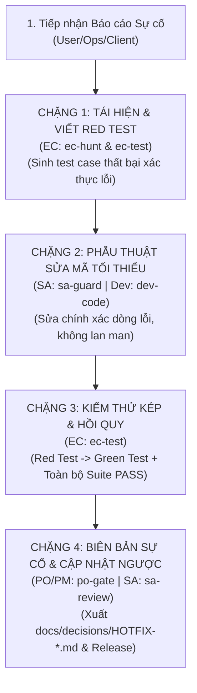

# QUY TRÌNH VÁ LỖI KHẨN CẤP: wf-hotfix (FAST-TRACK SURGICAL FIX & PRODUCTION SAFETY)

> **Mã Quy Trình**: `wf-hotfix`  
> **Tác Tử Chủ Trì**: **EC Agent (`ec`)** (Săn & khóa lỗi) & **Dev Agent (`dev`)** (Phẫu thuật sửa mã)  
> **Tác Tử Phối Hợp**: **TL/SA Agent (`techlead-sa`)**, **PO/PM Agent (`po-pm`)**  
> **Cổng Kết Thúc**: Hotfix Regression Pass & Post-Mortem Sign-off

---

## 1. MỤC TIÊU CỐT LÕI & NGUYÊN TẮC "PHẪU THUẬT CHÍNH XÁC"

Khi hệ thống gặp lỗi nghiêm trọng trên Môi trường Thực tế (Production P0/P1) hoặc đợt nghiệm thu UAT:
- **Nếu chạy quy trình `wf-autopilot` đầy đủ 7 bước**: Quá cồng kềnh, mất nhiều thời gian trong khi khách hàng đang chịu gián đoạn dịch vụ.
- **Nếu cho lập trình viên tự ý sửa nhanh (Cowboy Coding)**: 80% trường hợp sẽ gây ra lỗi hồi quy mới (Regression Bugs) và làm tài liệu bị trôi dạt.

Quy trình `wf-hotfix` áp dụng nguyên lý **"Test Đỏ trước ➔ Phẫu thuật tối thiểu ➔ Test Xanh ➔ Bảo tồn tri thức"**:
1. **Không sửa khi chưa có Test tái hiện lỗi**: Phải viết 1 Unit/Integration Test thất bại (Red Test) chứng minh lỗi tồn tại.
2. **Can thiệp tối thiểu (Minimal Surgical Change)**: Chỉ sửa đúng phạm vi lỗi, không tiện tay refactor hay thêm code ngoài lề.
3. **Bảo vệ 100% hồi quy**: Toàn bộ hệ thống test suite cũ phải PASS trước khi phát hành bản vá.
4. **Biên bản sự cố (Post-Mortem Incident Report)**: Ghi lại nguyên nhân gốc (Root Cause) và cập nhật tài liệu kiến trúc.

---

## 2. BẢNG ĐIỀU HƯỚNG TỆP TIN ĐẦU RA (ENFORCED DIRECTORY CONTRACT)
Tất cả các tài liệu và mã nguồn vá lỗi BẮT BUỘC lưu tại:
- `tests/unit/` hoặc `tests/integration/`: Chứa kịch bản test tái hiện lỗi (Reproducing Red Test)
- `docs/decisions/HOTFIX-[MÃ_LỖI]-[TÊN_NGẮN].md`: Biên bản sự cố & giải pháp kỹ thuật (Post-Mortem)
- Cập nhật ngược tài liệu thiết kế nếu có thay đổi logic: `docs/01-basic-design/` hoặc `specs/`
- Cập nhật phiên bản vá lỗi: `backlog/ROADMAP.md`

---

## 3. CÁC BƯỚC THỰC THI 4 CHẶNG (SURGICAL FLOW)

### Chặng 1: Tiếp Nhận, Tái Hiện Lỗi & Khóa Bằng Test Đỏ [EC Agent]
- **Kỹ năng sử dụng**: `ec-hunt` & `ec-test`
- **Hành động**:
  - Đọc log lỗi, phân tích stacktrace và điều kiện biên gây sập ứng dụng.
  - Viết ngay 1 test case tự động tái hiện lỗi (`test_reproduce_bug_[id]`).
  - Chạy test và xác nhận kết quả **FAIL (ĐỎ)**. Đây là bằng chứng pháp lý chứng minh lỗi tồn tại.

### Chặng 2: Định Vị Nguyên Nhân Gốc & Sửa Mã Tối Thiểu [TL/SA + Dev Agent]
- **Kỹ năng sử dụng**: `sa-guard` & `dev-code`
- **Hành động**:
  - SA rà soát ranh giới và xác định Root Cause.
  - Dev tiến hành phẫu thuật tối thiểu (Minimal Surgical Fix) trên `src/`. Tuyệt đối không tái cấu trúc hay sửa lan sang các file không liên quan.

### Chặng 3: Xác Nhận Test Xanh & Chạy Kiểm Thử Hồi Quy [EC Agent]
- **Kỹ năng sử dụng**: `ec-test`
- **Hành động**:
  - Chạy lại test tái hiện lỗi: Kết quả chuyển từ **FAIL (ĐỎ) ➔ PASS (XANH)**.
  - Chạy toàn bộ Test Suite của dự án (Unit + Integration + E2E) để đảm bảo không phát sinh bất kỳ lỗi hồi quy nào (Zero Regression).

### Chặng 4: Lập Biên Bản Post-Mortem & Ký Duyệt Xuất Xưởng [PO/PM + SA Agent]
- **Kỹ năng sử dụng**: `po-gate` & `sa-review`
- **Hành động**:
  - Xuất tài liệu biên bản sự cố `docs/decisions/HOTFIX-[MÃ_LỖI].md` ghi rõ:
    - Hiện tượng & Mức độ ảnh hưởng.
    - Nguyên nhân gốc (Root Cause).
    - Giải pháp đã khắc phục & Files bị thay đổi.
    - Biện pháp phòng ngừa tương lai.
  - Cập nhật ngược lại spec hoặc tài liệu thiết kế nếu logic nghiệp vụ có sự điều chỉnh.
  - PO/PM ký duyệt xuất xưởng bản vá (Release Tag / Hotfix Build).
