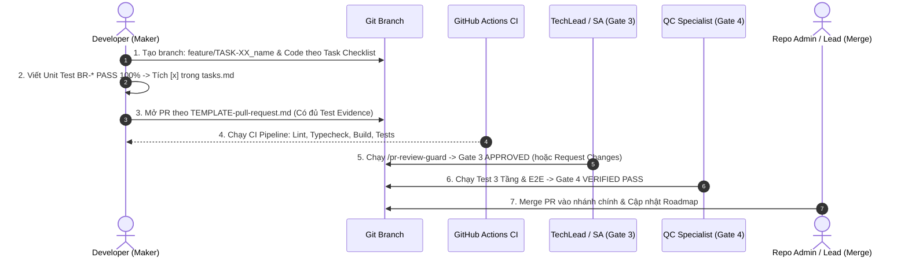

# WORKFLOW: QUY TRÌNH KIỂM SOÁT TASK & PULL REQUEST REVIEW (`wf-pr-review`)
*Enterprise Quality Gate 3 (TechLead/SA) & Gate 4 (QC Verification)*

---

## 1. MỤC TIÊU VẬN HÀNH
- Thiết lập cơ chế **Maker - Checker** nghiêm ngặt cho mọi dòng code trước khi merge vào nhánh chính.
- Loại bỏ hoàn toàn tình trạng:
  - Tự ý tick `[x]` task khi chưa có unit test chạy thật.
  - Rò rỉ ORM Context/DbContext lên tầng API.
  - Migration phá hủy dữ liệu (destructive migrations).
  - Lỗ hổng IDOR hoặc vi phạm cô lập Multi-tenant/Org.
  - Thiếu 5 trạng thái UX trên Frontend.

---

## 2. CHU TRÌNH VẬN HÀNH 5 BƯỚC

---

## 3. CHECKLIST 3 GIAI ĐOẠN CHO TỪNG TASK
Khi lập trình bất kỳ task nào trong `tasks.md`, Developer bắt buộc đối chiếu theo `templates/TEMPLATE-task-review-checklist.md`:
1. **Pre-task**: Xác định Scope, mã `REQ-`, `BR-`, `API-`, `UI-` và tác động chéo (Cross-Surface Impact).
2. **In-progress**: Ranh giới Clean Architecture, kiểm soát CSDL phi phá hủy, chống N+1, chống IDOR, 5 trạng thái UX `<Async>`.
3. **DoD**: Unit test 100% `BR-*` và local build pass 100%.

---

## 4. 6 TRỤC KIỂM SOÁT PULL REQUEST (PR REVIEW CHECKLIST)
Mọi PR bắt buộc áp dụng `templates/pull_request_template.md`:
- **Trục 1: Clean Architecture Boundary**: Độc lập tầng Domain, API chỉ gọi qua Interface/Use Cases, không leak Entity ra response.
- **Trục 2: CSDL, Schema & Migration**: Migration phi phá hủy (cột mới có default/nullable), Indexing đầy đủ, Optimistic Locking, chặn N+1 query.
- **Trục 3: An ninh & Scoped RBAC**: Policy Role + Scope + Action, chống IDOR (luôn kèm OrgId/TenantId/UserId), Magic Bytes file upload.
- **Trục 4: Concurrency & Idempotency**: Header `Idempotency-Key` cho API ghi/thanh toán, Transaction an toàn.
- **Trục 5: Frontend UX 5 States**: Loading Skeleton, Empty, Error Retry, Success Data, Partial/Paging; Responsive không tràn chữ.
- **Trục 6: Testing & Evidence**: 100% Unit Test `BR-*` kèm ảnh chụp kết quả test và giao diện thật.

---

## 5. ĐIỀU KIỆN TIÊN QUYẾT ĐỂ MERGE (ZERO-BYPASS RULE)
- **Gate 3 (TechLead / SA Approve qua `/pr-review-guard`)**: Xác nhận tính toàn vẹn kiến trúc, schema và an ninh.
- **Gate 4 (QC Verification PASS)**: Xác nhận kiểm thử 3 tầng và E2E Flow.
- **Không tick hình thức**: Mọi checkbox trong PR bắt buộc có Test Evidence tương ứng.
